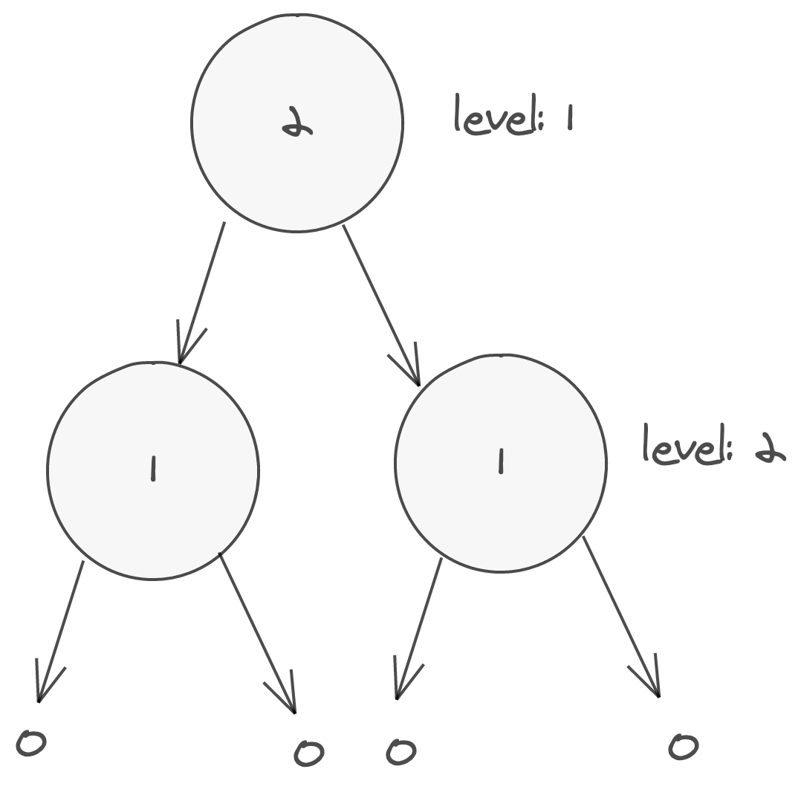

Maximum Depth of Binary Tree

# Maximum Depth of Binary Tree

Imagine we have this binary tree:



Each node shows its current level: 0, 1 or 2.

Thinking about this, if we do not have a node, we know that this has a
level of 0. If there is a node, the level is the maximum of its right or
left max depth + 1 (to account for the current node).

In code:

```py
{{# include _include/code/algorithms/leetcode/python/maximum_depth_of_binary_tree/main.py }}
```
