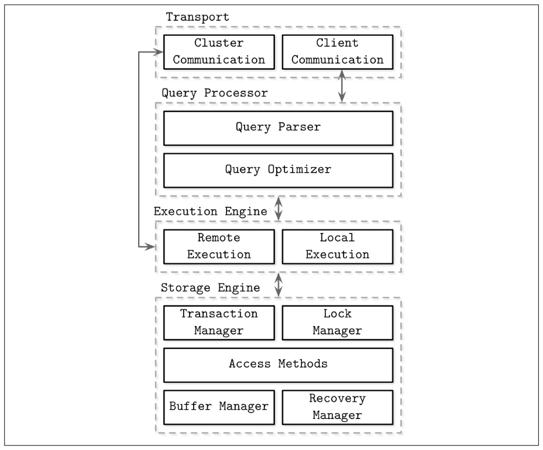

Next: [b-tree-basics](b-tree-basics.md)

# Storage Engines Introduction and Overview

Databases come in three general groups, based on the queries they run.

**Online Transaction Processing (OLTP)**: large amounts of queries that are predefined, short-lived
**Online Analytical Processing (OLAP)**: complex aggregations used for analytics. Complex and long-lived
**Hybrid Transactional and Analytical Processing (HTAP)**: Run both OLTP and OLAP queries

The architecture of a DBMS might look like the following:

## Memory Vs Disk-Based DBMS

Some databases which operate purely in memory have becoming more popular, due to the decrease in cost, and less complexity to implement in-memory versus on-disk data structures. [^1]

[^1]: Intel Optane (now discontinued) used to combine the properties of the fast access of RAM (~30 microseconds) with the durability of an SSD. It did not become very popular, however.

## Column Vs Row Oriented DBMS

Most RDBMS' are row-oriented, meaning each row is stored as a data unit. Some databases are column-oriented, where they store each column in an array. Most OLTP workloads prefer row-orientation, because they grab data horizontally, whereas OLAP workloads may grab certain parts of a record, and thus prefer column orientation. [^2]

[^2]: Some examples of row oriented databases: MySQL, Postgres. Some examples of column oriented databases: Cassandra, Clickhouse.

### Distinctions and Optimizations

Choosing data layout has a large impact in potential optimizations. For example, for time-series databases, which store very similar data, compression can save 95%+ of the memory costs of data. [^3]

[^3]: Facebook's Gorilla DB was able to reduce every row of data (a 3-tuple of string key, 8-byte timestamp, and 8-byte floating point number) from 16 bytes to 1.37 bytes, about 12x compression on each row, by exploiting redundancy in nearby rows.

### Wide Column Stores

Wide column stores [^4] represent data as a multidimensional map. Columns are grouped into column families, which store data of the same type, and data is stored row-wise. This is useless for storing data retrieved by key or sequence of keys.

[^4]: e.g. BigTable and HBase

This allows data to be fetched from hierarchical indexes. As well, column families store multiple versions of data by timestamp, which allows them to quickly locate higher-level entries.

### Data Files and Index Files

A database file stores data to allow quick access. That means that

Next: [b-tree-basics](b-tree-basics.md)
