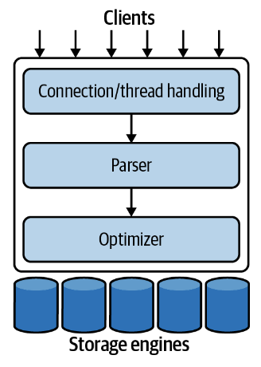

# MySQL Architecture

Next: [monitoring-in-a-reliability-engineering-world](monitoring-in-a-reliability-engineering-world.md)

The architecture for MySQL looks like this:

The first layer handles connection pooling.

The second layer handles parsing the SQL given into an optimized form.

The third layer contains the storage engines. Storage engines have
different drawbacks, but the most popular one in MySQL is InnoDB.

## Optimizing

The optimizer might rewrite the query, determine the order it will read
tables, which indexes to use, and so on. Hints may be provided to the
Query optimizer.

One note: MySQL used to use a query cache to serve results. With the
increase in concurrency, though, the query cache was deprecated in MySQL
5.7.20. This pattern is useful, so caching can be done in Memcached or
Redis.

## Concurrency Control

### Read/Write Locks

- Multiple readers are not problematic. There can be infinite readers as
  long as there are no writers.
- If there is one writer, however, on every write, each read can be
  corrupted.
- To handle this, we use Read/Write locks. Writers block all readers and
  writers, and readers block nobody. All readers get a shared lock,
  while all writers get an exclusive lock, which block the readers as
  well.

### Lock Granularity

- We don't want to lock a whole table if we only want to edit a row.

MySQL storage engines offer a few solutions:

#### Table locks

- Lock the whole table

#### Row locks

- Row locks are implemented in the storage engine, and allow for
  multiple writers to a table, as long as they edit unique rows. They
  come with heavy overhead though, since R/W locks must be maintained
  for each row, and getting a lock can be very expensive.

## Transactions

Transactions allow us to batch reads and writes, and follow ACID
principles

## Isolation Levels

- Read Uncommitted: Readers can read from uncommitted transactions
- Read Committed: Readers can read from committed transactions
- Repeatable Read: Any read done after another will not have phantom
  reads
- Serializable: All transactions must be partially ordered.

## Transaction Logging

- MySQL uses a Write ahead log, which means appending to durable
  storage, and then updating its in-memory representation. Afterwards,
  it will persist the change to disk. If MySQL crashes in between, it
  can redo the change by fetching it from the WAL.

## Transactions in MySQL

By default, all commands are wrapped in a transaction and committed
immediately.

To create a transaction, disable the `AUTOCOMMIT` variable by setting it
to 0, or use `BEGIN` or `START TRANSACTION`.

Certain commands that affect the DDL (`ALTER TABLE`, `LOCK TABLES`)
are immediately committed.

The isolation level can be changed by using `SET TRANSACTION ISOLATION LEVEL`.

Note: Since transactions are managed by storage engines, not MySQL,
mixing storage engines during transactions can cause lost data during
rollbacks.

You can explicitly lock a table in two-phase commit by using `SELECT ... FOR SHARE` or `SELECT ... FOR UPDATE`.

## Multiversion Concurrency Control

MVCC is used in tandem with Row-level locking mechanisms for increasing
concurrency. MVCC takes snapshots of the data as it existed in some
point in time for writes. Thus, all reads can read the data that
corresponds to the time they are in, so there's no need for locks (since
readers dont block writers or vice-versa). This comes with the caveat
that MVCC only works with `READ COMMITTED` and `REPEATABLE READ`.
`SERIALIZABLE` is not allowed because reads lock every row to create
ordered reads.

## Replication

Since MySQL is designed to accept writes on one node, the default way to
increase reliability is through replication, which involves a leader
node replicating writes to all the other nodes through binary log
shipping.

### Datafiles

In MySQL 5.X, you can query the `information_schema` to get data about
tables. In MySQL 8.X+, all that information has been included in the
tables `.ibd` file.

## InnoDB

InnoDB is the default engine, which performs well for processing
short-lived transactions that mainly complete instead of being rolled
back. It uses MVCC, defaults to `REPEATABLE READ`, and prevents phantom
reads by using a next-key locking strategy.

Its tables use a clustered index, so it provides fast primary key
lookups, but secondary indexes contain the primary key columns, so
secondary indexes are generally very large.

It supports hash indexes, read-ahead prefetching data from disk, and
insert buffers for faster inserts.

It supports hot online backups through a variety of services as well.

MySQL 5.6 allowed for in place updates of tables as well.

MySQL 8 introduced atomic data definition changes. In MySQL 5, if DDL
statements partially finished in a transaction, they would be partially
applied.

Next: [monitoring-in-a-reliability-engineering-world](monitoring-in-a-reliability-engineering-world.md)
