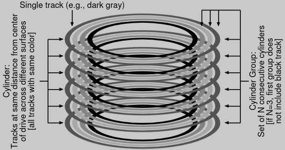

# Locality and the Fast File System

Prev: [[41-file-system-implementation]]
Next: [[43-crash-consistency-fsck-and-journaling]]

The first file system for linux was very simple, laying out the super block, the inodes, then the data.

## The Problem: Poor Performance

However, simplicity has a cost: poor performance. The disk performance started off fine, but would suffer from fragmentation, and needed to be defraged from time to time. Disk also works better with sequential access, and this setup would put files far away from their inodes, which led to long seek times.

As well, the original block size was too small (512 bytes). Smaller blocks minimized internal fragmentation, but the positioning overhead overtook that.

## FFS: Disk Awareness is the Solution

A group at Berkeley decided to build a file system called the Fast File System, (FFS). It was meant to be "disk aware" while keeping the old unix API of `open()`, `read()`, `write()`, and `close()`.

## Organizing Structure: The Cylinder Group

The Fast File System divides disks into cylinder groups, which consist of cylinders that are the same distance from the center of the drive. These form the cylinder groups as mentioned before.

Modern File systems like (ext4) organize the drive into block groups, which are consecutive portion's of the disk's address space.

Each group contains the following info:

- A Super block for mounting the file system.
- An inode bitmap and data bitmap for tracking metadata.
- an inode and data block region, comprised of data blocks.

## Policies: How to Allocate Files and Directories

FFS now has to group related things together, and put unrelated things far away. To do this, it uses some heuristics:

- Directories are placed by finding the group with a low number of directories and high number of free inodes
- For files, it tries to allocate the data blocks in the same group as its inode, and places all files that are in the same directory in the cylinder group they are in.

This works because files and directories are a pragmatic grouping for the user, which they will end up accessing similarly. This improves performance for most users.

## Measuring File Locality

You'll want some heuristic to figure out how well the file system works. One way is to use SEER traces, which record the use of 9 people on a file system. 50% of the time, the user opened up the same file or one in the same directory, and 25% to a distance of two (one more directory out), so our heuristic works pretty well.

## The Large-File Exception

We need to have an exception for large files, because a large file could take up an entire block group. Instead, the FFS splits up large files into chunks, and puts them in different block groups. This works well due to amortization of seek and transferring speeds.

## A Few Other Things About FFS

FFS had a few other innovations: it used 512KB sub-blocks, which would eventually be aggregated into a full 4KB block. Thus, smaller I/Os would be well served, and larger I/Os were faster (since they could just start off with a 4KB block.

FFS also handled some antiquated details by allocating blocks differently, allowed longer file names, created symbolic links, and introduced an atomic `rename()` system call.

Prev: [[41-file-system-implementation]]
Next: [[43-crash-consistency-fsck-and-journaling]]
