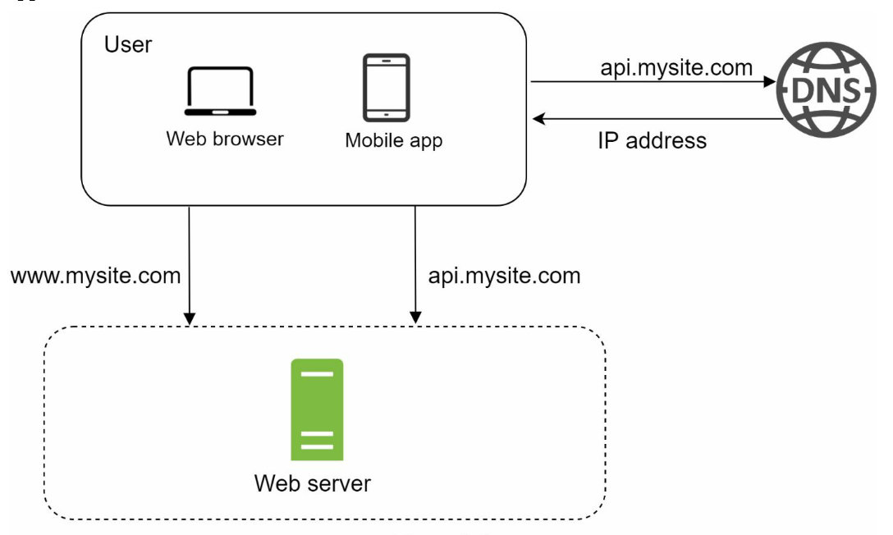
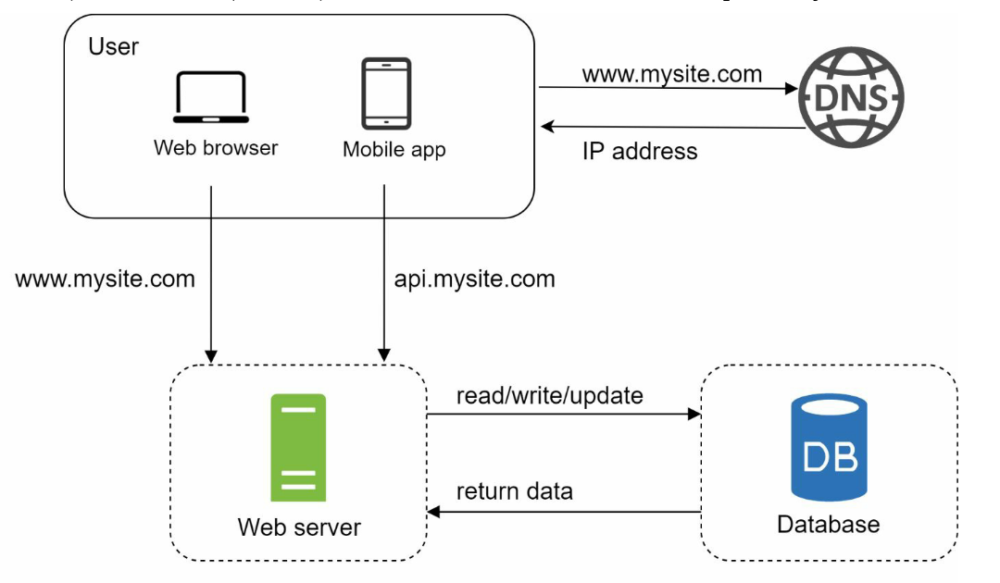
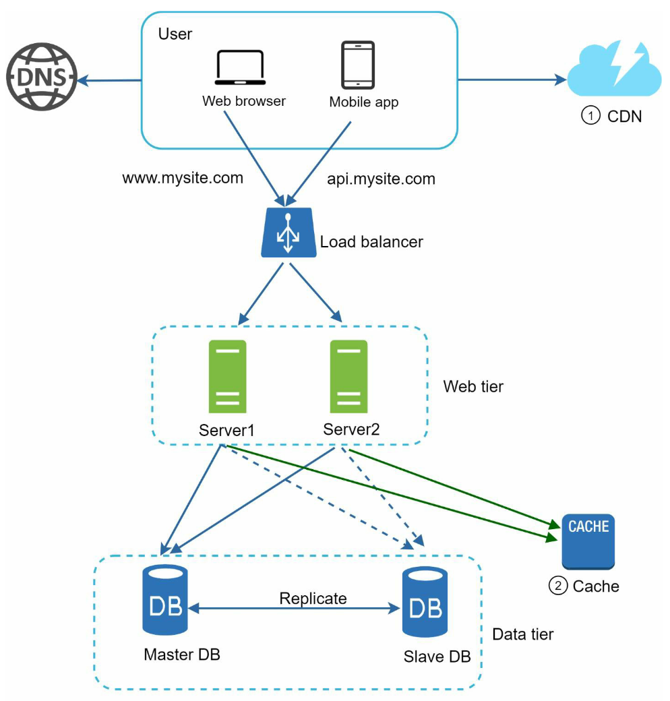
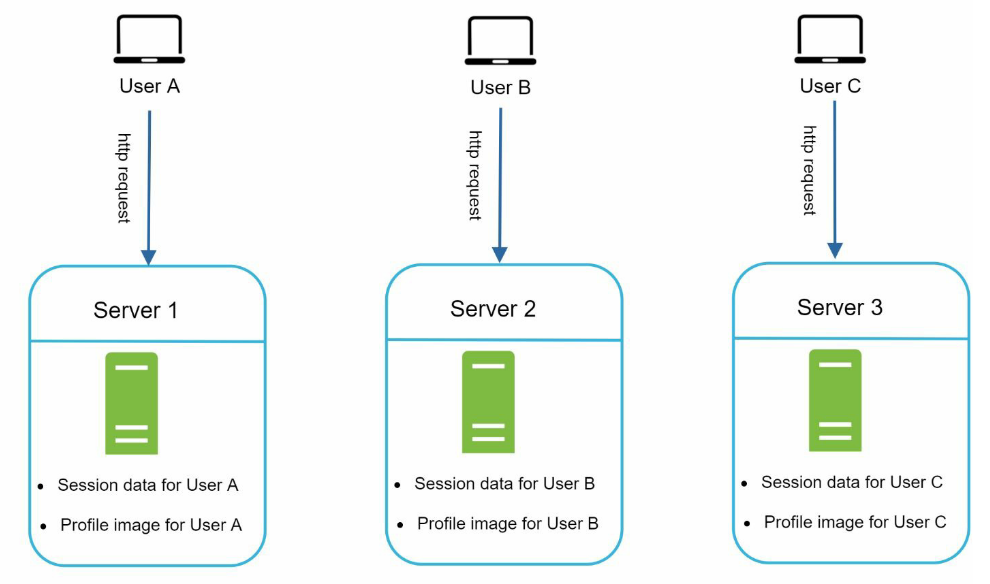
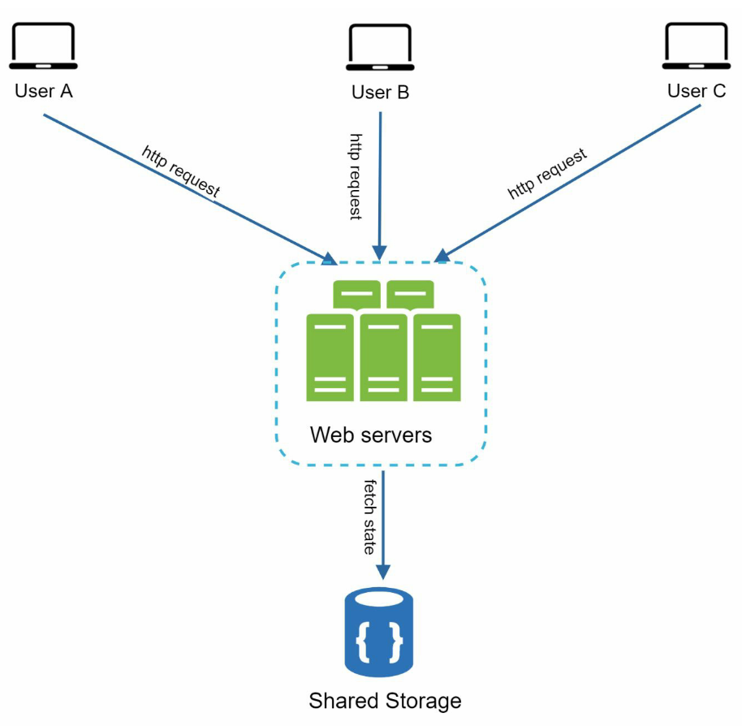
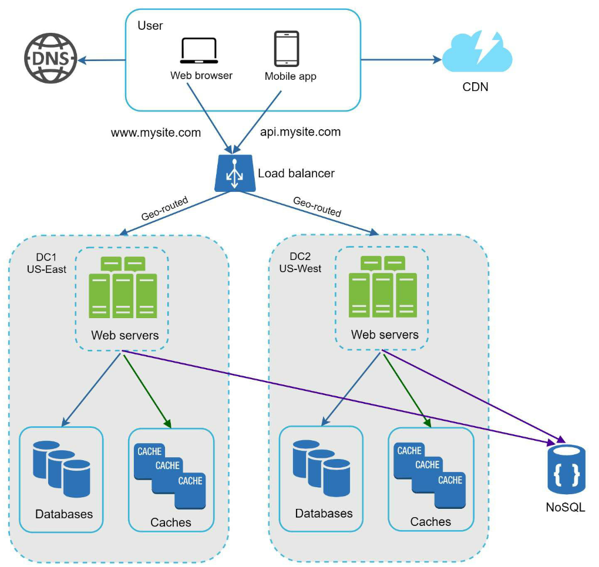
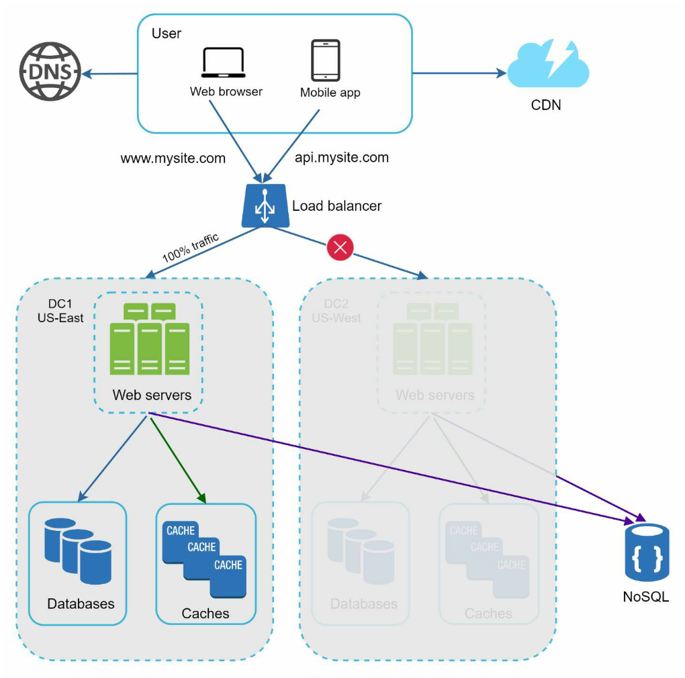
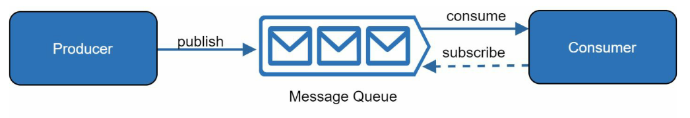

Next: [chapter-2-back-of-the-envelope-estimation](chapter-2-back-of-the-envelope-estimation.md)

# Scale from zero to millions of users

## Single Server Setup

First, you might try to put everything on a single server.



Breaking that down, first each client makes a DNS request to the DNS
server to get the IP address connected to www.mysite.com. Then requests
are made to our IP address, which returns HTML pages/JSON for clients.

## Split DB from Requests

To handle more users, we'll split out the db so it can scale
independently.



### Choosing a DB

Relational databases (RDBMS) represent and store data in tables and
rows. You can join across tables using foreign keys.

Non-Relational Databases (NoSQL) are grouped into four categories:

- Key-value
- Graph
- Column
- Document

## Vertical Scaling vs Horizontal Scaling

Vertical Scaling means adding more power to your servers. Horizontal
Scaling means adding more servers to your pool of servers.

Pros of Vertical Scaling:

- Simplicity (fewer machines to manage)
- Can be stateful (horizontal architectures are mostly stateless).

Cons of Vertical Scaling:

- No failover/redundancy
- Hard limit (you can't add RAM and processors to one server)
- Expensive (adding to one server continuously costs too much).

## Load Balancing


With a load balancing setup, clients now query the load balancer, which
routes requests to N number of servers in a private IP. The load
balancer communicates with web servers through private IPs and returns
the requests. Now we have graceful failover for requests made to the
web.

## Database Replication

To achieve failover for the database tier, one way is master slave
partitioning.


Advantages:

- Better Performance: More queries are processed in parallel.
- Reliablity: data is still preserved even if a server goes down since
  you have 4 copies of the same data
- High availability: your site is up as long as one database instance
  is up, and if master goes down, one of the slaves will replace it.


## Caching

A cache tier is a fast in-memory storage that stores the result of
expensive results or frequently accessed data.

Caches make reads faster, since the web server can query the cache
first, and if there's a cache hit, it can serve that data instead.

you would cache normally like so (using memcached):

```js
const Memcached = require(;
const cache = new Memcached();

cache.set("myKey", "hi there", 3600); // 1 hour
cache.get(; // should return 'hi there'
```

Caching improves performance, but is complicated when synchronizing the
webserver with the cache.

## Content Delivery Network

You can use a CDN to cache data, which serves static assets as long as
the TTL has not expired.



## Stateful vs Stateless Architecture



Stateful architectures allow the web server to keep state in between
requests -- but that requires that sessions are always routed to the
same web server, which can be challenging and makes adding or removing
servers problematic, since if a server goes down, some state will
disappear for our users.



Stateless architectures do not keep the user's state, instead, they
store state in a data layer that has its own mechanisms for reliability.
This both has higher consistency and availability.

## Data Centers

- If you a lot of international users, you'll want to divide the web
  servers and databases out into data centers.



If one data center is down, the load balancer will load balance to
another region.



This adds some complication:

- Traffic redirection based on IP
- Data Synchronization: make all regions synchronized.

## Message Queues

To decouple the server from other servers/workers, you can use a message
queue. This message queue keeps a buffer of tasks to do, completes the
task, then notifies consumers who are subscribed.



## Loggin, metrics, automation

When working with a large system, you must have logging and metrics.

- Logging can be centralized or per-server.
- Metrics help you understand the performance of the system and the
  business.


## Database Scaling

### Vertical Scaling

- You can scale your database vertically (e.g. having one master
  server), and adding more CPU, RAM, etc.

Cons:

$$$

### Horizontal Scaling

- Sharding separates large databases into smaller, more managed parts
  called shards.

A hash function can be used to hash users, for example, so users go to
the shard of their user_id % 4.

Cons:

- Resharding data might happen often, which requires a re-indexing of
  all databases. Consistent hashing can lower the load of re-indexing.
- Celebrity problem: Some keys are more popular than others, which
  requires special shards for these users.
- Joins no longer work: you require de-normalization to query for data
  you might've done so prior.

Databases can also be sharded by table, but if a particular shard goes
down, you will lose data to that table.

Concluding Tips:

- Keep web tier stateless
- Build redundancy at every tier
- Cache data as much as you can
- Support multiple data centers
- Host static assets in CDN
- Scale your data tier by sharding
- Split tiers into individual services
- Monitor your system and use automation tools

Next: [chapter-2-back-of-the-envelope-estimation](chapter-2-back-of-the-envelope-estimation.md)
