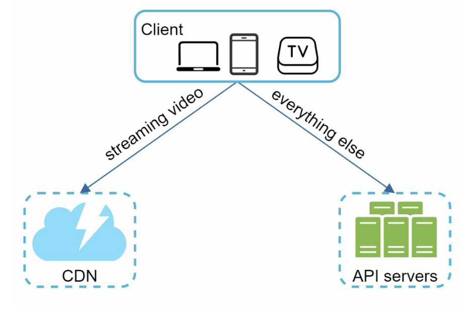
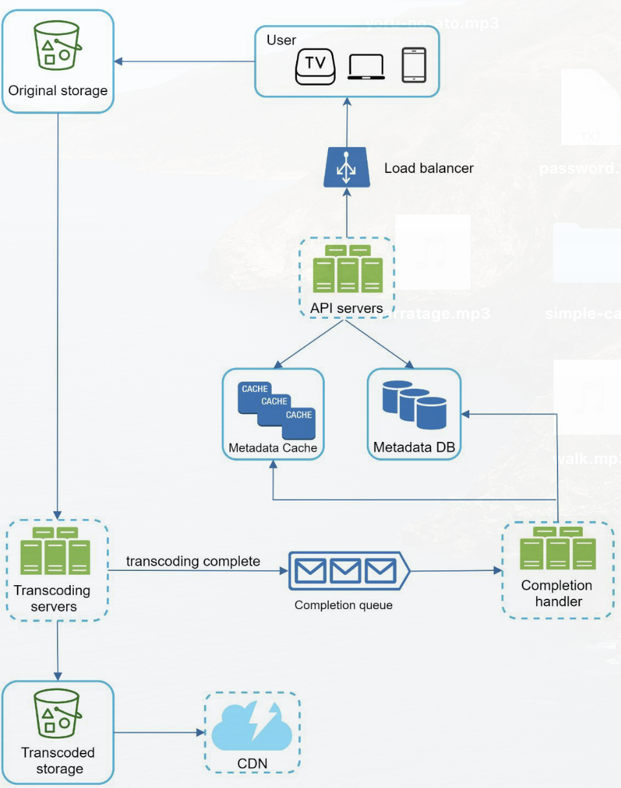
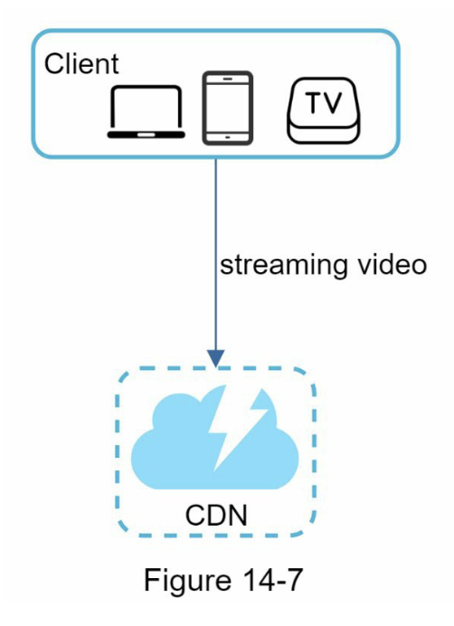
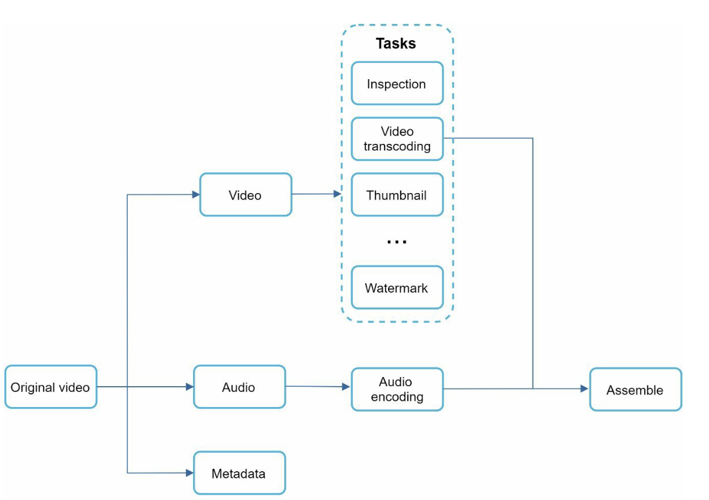

# Chapter 14 Design Youtube

Prev: [chapter-13-design-a-search-autocomplete-system](chapter-13-design-a-search-autocomplete-system.md)
Next: [chapter-15-design-google-drive](chapter-15-design-google-drive.md)

Scale:

- 2 billion MAU.
- 5 billion videos watched per day.
- 37% of all mobile internet traffic.

Requirements:

Q: Important features?
A: Uploading and watching videos.

Q: What clients are supported?
A: Mobile, web, TV

Q: What is the DAU?
A: 5 million

Q: Average time spent on platform?
A: 30 minutes.

Q: Is I18n required?
A: yes.

Q: What are some supported video resolutions/formats?
A: many, from 240p to 8k, and most audio/video formats.

Q: Is encryption required?
A: yes.

Q: What are the average file sizes for videos?
A: The max allowed is 1GB.

Q: Can we use the cloud?
A: Feel free to use cloud services as much as you want.

## Back of the Envelope Estimation

Assume 5 million users use the service daily.
Users watch 5 videos per day.
10% of users upload 1 video per day.
The average video size is 300MB.
Daily storage needed = 5 Million _ 10% _ 300MB = 150TB.
With a CDN like CloudFront, assume 2c/GB cost for viewing. This is 150k a day.

## High-level design

This is split into two parts: Video Uploading and Viewing:

## Uploading Flow

1. Videos are uploaded to original storage.
2. Transcoding servers fetch videos from original storage and start transcoding.
3. Transcoded videos are sent to transcoded storage.
4. A completion message is queued up.
5. Transcoded videos are distributed to the CDN.
6. Completion messages are handled by workers that pull from queue.
7. Workers update metadata database and cache.
8. API server informs client that the video is ready for streaming.

## Video Streaming Flow

## Design Deep dive

We need to explain how we will convert between different file formats and codecs. To do so, we can adopt a DAG model.

A video is split into its three parts (Video, Audio, Metadata) and encoding video, audio, and metadata is done separately. At the end, when all work has been done, it is assembled back together.

The preprocessor will do splitting of video into Group of Pictures (GOP). These chunks can then be processed in some way. For example, the client could split the video into chunks, and parallelize uploads for those with spotty network conditions.

Prev: [chapter-13-design-a-search-autocomplete-system](chapter-13-design-a-search-autocomplete-system.md)
Next: [chapter-15-design-google-drive](chapter-15-design-google-drive.md)
