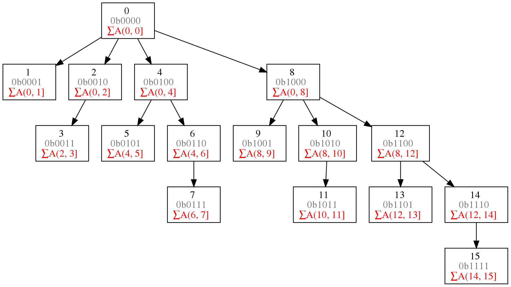

# Data Structures

Prev: [algorithm-analysis](algorithm-analysis.md)
Next: [sorting](sorting.md)

## Exercises

1. A common problem for compilers and text editors is determining whether
the parentheses in a string are balanced and properly nested. For example, the
string `((())())()` contains properly nested pairs of parentheses, while the strings
`)()(` and `())` do not. Give an algorithm that returns true if a string contains
properly nested and balanced parentheses, and false if otherwise. For full credit,
identify the position of the first offending parenthesis if the string is not properly
nested and balanced.

Write a program that looks like the following:

```python
def balanced(s: str) -> bool:
    stack = []
    for c in s:
        if c == '(':
            stack.append(c)
        elif c == ')':
            if not stack:
                return False
            else:
                stack.pop()


    return True
```

2. Give an algorithm that takes a string S consisting of opening and closing
parentheses, say `)()(())()()))())))(`, and finds the length of the longest balanced
parentheses in S, which is 12 in the example above. (Hint: The solution is not
necessarily a contiguous run of parenthesis from S.)

3. Give an algorithm to reverse the direction of a given singly linked list. In
other words, after the reversal all pointers should now point backwards. Your
algorithm should take linear time.

4. Design a stack S that supports S.push(x), S.pop(), and S.findmin(), which
returns the minimum element of S. All operations should run in constant time.

Have a stack, s, which has a tuple of `(item, curr_min)`. When you push onto the stack, record the current min by looking at the previous item and taking the minimum of that and the current item.

```python
class MinStack():
    def __init__():
        self.stack = []
    def push(self, item):
        if not self.stack:
            self.stack.append((item, item))
        else:
            self.stack.append((item, min(item, self.stack[-1][1])))

    def pop(self):
        return self.stack.pop()[0]

    def find_min(self):
        return self.stack[-1][1]
```

5. We have seen how dynamic arrays enable arrays to grow while still achieving
constant-time amortized performance. This problem concerns extending
dynamic arrays to let them both grow and shrink on demand.
    a.  Consider an underflow strategy that cuts the array size in half whenever
the array falls below half full. Give an example sequence of insertions and
deletions where this strategy gives a bad amortized cost.
    b. Then, give a better underflow strategy than that suggested above, one that
achieves constant amortized cost per deletion.

6. Suppose you seek to maintain the contents of a refrigerator so as to minimize
food spoilage. What data structure should you use, and how should you use
it?

I would use a priority queue, since food might have a different best by date. This allows for polling for items that are closest to expiration.

7. Work out the details of supporting constant-time deletion from a singly
linked list as per the footnote from page 79, ideally to an actual implementation.
Support the other operations as efficiently as possible.

26. Suppose that we are given a sequence of n values $x_1,x_2,\dots,x_n$ and seek to
quickly answer repeated queries of the form: given i and j, find the smallest
value in $x_i,\dots,x_j$ .
a. Design a data structure that uses $O(n^2)$ space and answers queries in $O(1)$
time.

If we're allowed to use $O(n^2)$ space, we can create a hashmap -> min for each tuple of $(i, j)$.

```python
{(i, j): min(x[i..j]) for i, j in zip(x, x[1..])}
```

b. Design a data structure that uses $O(n)$ space and answers queries in
$O(log n)$ time. For partial credit, your data structure can use $O(n log n)$
space and have $O(log n)$ query time.

For a better solution, we can use a segment tree. We would recursively split up the given array, X into pairs.
Imagine something like this:
$(0, 1), (2, 3), (4, 5), (6, 7)$
Assume their minimums are like this:
$(4), (5), (6), (7)$
We would then calculate the minimum for each of these pairs:

Then, we would join the adjacent elements and hoist their minimums up the chain.
We would then have a way to get the minimums of the parts of the range `i..j`.

You can use a fenwick tree for $O(n)$ space and $O(log n)$ query.




Prev: [algorithm-analysis](algorithm-analysis.md)
Next: [sorting](sorting.md)
