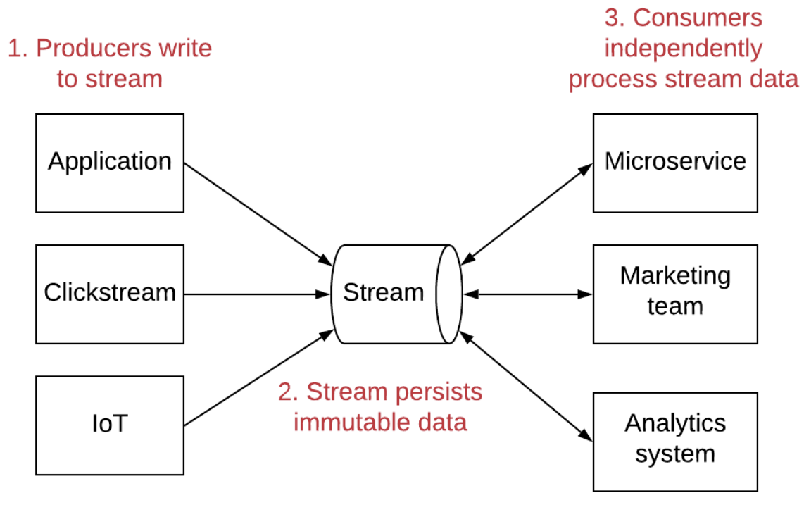
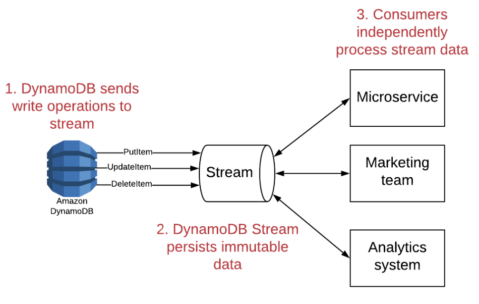

# Advanced Concepts

Prev:
[core-concepts-in-dynamodb](core-concepts-in-dynamodb.md)
Next:
[the-three-api-action-types](the-three-api-action-types.md)

## DynamoDB Streams

Streams are an event driven paradigm of posting a series of immutable
records that can be processed by multiple, independent consumers.

Writing to dynamodb can then be consumed by independent services:

## Time to Live (TTL)

TTLs are used to store short-term data in DDB. You can set an attribute
as the TTL column, and populate it with a unix timestamp. After that,
DDB will periodically review your table and delete items that have your
TTL attribute set to a time before the current time.

This feature is also nice because you can set the TTL column, and some
items in the table can use it, and others can avoid it.

**Note** Items are generally deleted within 48 hours. Don't use this
feature for consistent and correct deletes.

## Partitions

DynamoDB shards its data by forwarding requests to a partition that
holds the data (by hashing the key of the request). This is generally
done transparently to the user, due to adaptive capacity.

You'll want to keep item collections in mind on a particular partition,
because this allows for fast queries on multiple items.

## Consistency

Each partition has an arbitrary amount of nodes on it. Each write
request to a partition goes first to the primary node, which does
synchronous replication to a secondary node. Afterwards, the node does
asynchronous replication to a third node (this is semi-synchronous
replication).

However, since all three nodes serve reads, this isn't a strongly
consistent read. You can elect for a Strongly Consistent read by using
the API (`ConsistentRead = True`). This consumes twice the RCUs, though.

GSIs are always eventually consistent, but local secondary indexes are
allowed to be strongly consistent.

## DynamoDB Limits

### Item Size Limits

A single DynamoDB item is limited to 400KB of data

### Query and Scan Request Limits

`Query` and `Scan` operations will read a maximum of 1MB of data from
your table before returning.

If you'd like to query more data, you must paginate.

### Partition throughput Limits

A Single partition can only serve 3000 RCUs or 1000 WCUs per second. If
you hit this throughput, you'll need to look into read or write sharding
data.

### Item Collection Limits

With a Local Secondary Index, a single item collection cannot be larger
than 10GB.

## Overloading Keys and Indexes

Since in DynamoDB we often put more than one kind of record into a
table, we'll want to overload keys.

Let's say we want to put OrgNames and Usernames in the same table.

We would prefix organizations with `ORG#` and users with `USER#`, so we
can tell if our record is a User or an organization. This also makes it
so that duplicate rows in supposed different tables won't overwrite each
other.

Prev:
[core-concepts-in-dynamodb](core-concepts-in-dynamodb.md)
Next:
[the-three-api-action-types](the-three-api-action-types.md)
