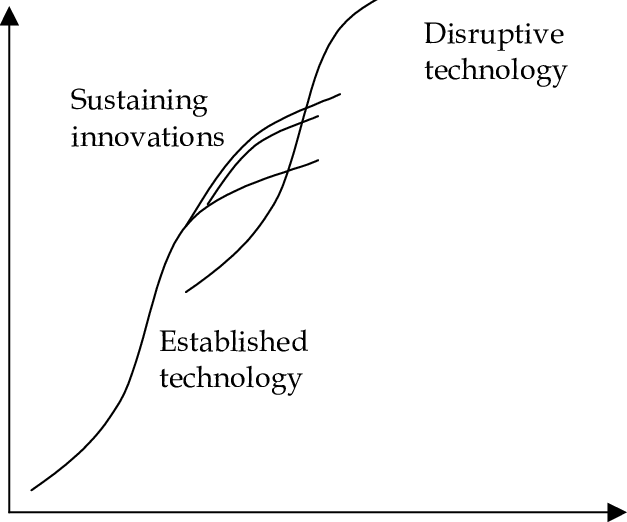

Innovators Dilemma

# The Innovator\'s Dilemma

Big companies always miss the next trend that revolutionizes their
industry. Sears dominated the catalog retail market, but missed the
advent of discount retailing, which Target and Walmart ate up.

IBM, a long time computer manufacturer, focused on mainframes and missed
the minicomputer market.

DEC, HP, and other small companies found their niche in minicomputers
(which Apple and others took away from them).

Apple and Microsoft took away the desktop computing market.

Only apple capitalized on the tablet and phone market. Others lagged
behind.

Traditional business management allows these failures, by having
companies focus on their core product due to chasing higher margins to
satiate stockholder appetites for short-termism, and eventually become
obsolete.

## The Dilemma

Sustaining technologies incrementally improve product performance by
bolting on some new features every year (think x86).

Disruptive technologies are an innovation that leads to a worse product
at first, that rapidly overtakes the sustained technology, making it
obsolete.

People stopped buying mainframes when they realized that a standard
desktop (or set of desktops) could do the job they needed at a lower
price.

As quality improved for products, cheaper products which would fulfill a
larger part of the market need went to discount retailers (like Target)
instead of Sears.

### Three Problems of Disruptive Technology vs Investment

1.  Disruptive technologies are cheaper than their sustained technology
    counterparts \-- this leads to lower margins, and lower profits.
2.  Disruptive technologies are commercialized in insignificant markets,
    and start out in a niche market.
3.  Thus, companies that listen to customers (who do not represent the
    niche market) and shareholders (who want higher margins) cannot
    muster the will to compete with disruptive technologies.

## Principles of Disruptive innovation

1.  Companies depend on customers and investors.

    - Investors rule your company \-- and since disruptive
      technologies take multiple years to come to fruition, investors
      veto investment (as they prefer short-term growth to long-term
      growth) and customers veto it (they want a better product now,
      rather than later).
    - Managers can combat this by allowing an autonomous part of the
      firm research the disruptive technology, without guard rails of
      the company at large.

2.  Small markets don\'t meet the growth needs of large companies.

    - Disruptive technologies often start out in small markets.
    - This is fine for small companies, as a \$40MM company only needs
      \$8MM in profits to grow its company by 20%.
    - A large company (\$4B) needs 400MM, so they would disregard this
      budding market as too small to compete in.
    - This can be abetted by spinning off an org relative to the size
      of the market and having that org own its own growth metrics and
      compete against other companies trying to introduce the product
      to the mainstream.

3.  Markets that don\'t exist can\'t be analyzed.

    - Market research is critical in fueling sustained development,
      since the market trajectory is clear and the technology is
      well-known.
    - Market research fails to predict the growth of smaller markets,
      and this handicaps big companies.
    - Companies with investors don\'t enter a market without hard data
      \-- but this data is useless, since it fails to capture the
      potential future value of that market.
    - To combat this, spin off an org, but allow it to remain
      autonomous and make decisions based on the market itself, rather
      than company wide goals.

4.  An organization\'s capabilities define its disabilities

    - An organization constitutes of its processes and its values.
      Processes and values are not readily transferrable, which means
      what succeeds in one market segment may not succeed in another.

5.  Technology supply may not equal market demand

    - The pace of technological progress in products outstrips the
      needs of users. Mainframes turn into desktops, which turn into
      laptops. Luxury brands are too expensive, so people turn to
      cheaper alternatives. Many companies are fine seceeding lower
      margin markets, which smaller firms take.

## Why Great Companies can Fail

- Hard disk companies are like the bacteria of business \-- a
  disruptive technology was introduced and killed the sustaining
  technology every 5 years at the latest. Almost no firm was around
  for more than one cycle of this, and no firms lasted longer than
  two.

## Chapter 2: Value Networks and the Impetus to Innovate

1.  Managerial

    - Some companies are slow to adapt because organizations mirror
      components \-- so teams are organizationally adept at producing
      products for technologies that involve sustained innovation, but
      are bad at new architectures, since that requires a new
      org-chart to fit the new architecture.

2.  Capabilities and Technology

    - Companies build competencies doing what they\'ve done before.
    - New firms don\'t have these capabilities, so they gravitate
      towards radical technology changes.
    - They may stumble to an org-chart that matches the innovation
      required for a disruptive technology, if they find enough
      support.

3.  Value Networks

    - Companies are embedded in a network which involves the products
      they sell \-- for example, Intel and AMD are embedded in a
      network that involves desktop computing \-- the fans,
      motherboards, RAM, Hard disk, cases, etc. They want to build
      technology that fits like a glove.

4.  Metrics of Value

    - Each product is embedded in a network of value, where customers
      rate its value on different facets (is it fast? is it cheap? is
      it performant? is it cool?)
    - For example, high-end computing values speed, but low-end
      computing values size, speed, ruggedness, and battery-life,
      which are contradictory values.

5.  Cost Structures

    - Higher end goods have high-margins, which means that research is
      diverted by business to divert into higher-margin goods, leaving
      behind the lower margin disruptive technology.

6.  Technology S-Curves

- Technologies leap frog each other \-- disruptive technologies always
  start off worse and end up better.
- Sustained growth is slow at first, then gets faster, and slows down
  again after hitting some physical limit, before a disruptive
  innovation takes its place.

### Managerial Discussions and Disruptive innovation

1.  Disruptive technology comes from established firm.
    - Big firms engineers create the technology that new entrants
      commercialize.
2.  The engineers asked customers for thoughts.
    - Customers didn\'t like this disruptive product, because they had
      more use for the sustained product, and research for the
      disruptive product is shelved.
3.  Established firms step up pace of improvement on sustained
    technology
    - Research interest is diverted to the sustained technology rather
      than the disruptive technology, because it has higher margins
      and is worth more to the firm.
4.  New Companies are formed
    - New companies (mainly of disgruntled engineers from the big
      firm) make a startup and pitch their product to a niche group of
      customers in a small market.
5.  The entrants move upward
    - The entrants take their product and improve upon it while
      listening to their customers. Eventually, they have a product
      that is superior in all ways to the sustained technology, and
      grow in size, eating away the big firm\'s margins.
6.  Established firms belatedly enter market
    - The established firms belatedly enter the market, but only
      either survive or are kicked out entirely.

## Chapter 3: Disruptive Technology in the Mechanical Excavator Industry

This story also pans out in the mechanical excavator industry.

- This industry had a disruptive technology from gas to steam to
  hydralic powered vehicles, which took many decades to fully happen,
  but each new technology eventually fully supplanted the previous
  industry.
- Smaller comapnies started by targeting firms who had fewer
  requiremetns than the others, and grew with them to sustain the use
  of the technology.
- Companies think of their products from the view of the market\'s
  needs, rather than the user\'s wants, which leads them to stick onto
  sustained technology and eventually lose to the disruptive
  technology.

## Chapter 4: What goes up can\'t go down

Leading firms find it difficult to enter downstream markets (where
margins are lower) but easy to go upstream (where margins are higher).

- Management is incentivized by promotions to pick safe projects -
  projects that improve their margins or otherwise benefit the
  company.
- This leads to organizations which are incentivized not to do
  anything risky.
- Disruptive innovation is disliked by customers and antithetical to
  analysis of data, hence, it is invisible and hard to argue with a
  company.
- Smaller comapnies do better at analyzing a disruptive technology,
  because they\'re not as data driven and are more flexible to change.

## Part Two: Managing Disruptive Technological Change

The five reasons why firms failed to be disruptive.

1.  Resource dependence
    - Customers held comapnies hostage
2.  Emerging markets
    - Small markets do not solve the growth needs of large firms, only
      small ones.
3.  Uses of disruptive technology are unknowable
    - Failure and success go hand in hand, and data is useless to
      understand the technology.
4.  Organizational Structure
    - Organizations have capabilities that help them in sustained
      growth that define their disabilities.
5.  Technology supply may not equal market demand.
    - Niche users might be a larger user base than you target.

### How to succeed against all of these

1.  Embedding a group that searched this disruptive technology with a
    group of customers who want to use it.
2.  Making their groups small, so they were decoupled from the parent
    company.
3.  They planned to fail early and Inexpensively.
4.  They used some of the parent company\'s resources as an advantage,
    but not the processes or values.
5.  By developing new markets that valued the attributes of disruptive
    markets.
