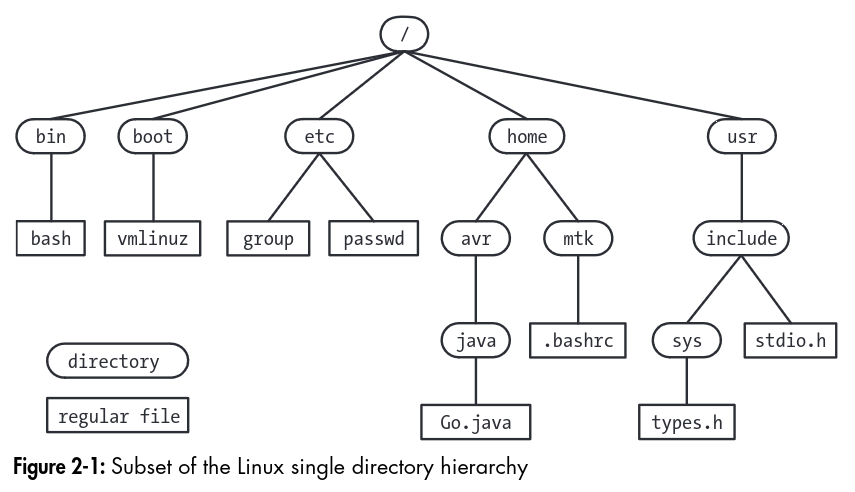

# Fundamental Concepts

Prev: [history-and-standards](history-and-standards.md)
Next: [system-programming-concepts](system-programming-concepts.md)

## The Core Operating System: The Kernel

The term kernel is used to refer to the central software that manages and allocates computer resources, like CPU, RAM, and devices.

The kernel exists to make writing programs easier, as it provides an abstraction that manages the limited resources of a computer for other programs.

### Tasks performed by the Kernel

The kernel performs some tasks such as:

- Process scheduling: running one or more processes, then swapping them in and out in turns. Linux is a preemptive multitasking operating system, which means that multiple processes are governed by the kernel process scheduler, which moves processes in and out, instead of having processes choosing how long to run.
- Memory management: memory such as RAM has to be shared between processes in an efficient fashion. Linux has virtual memory management, which does the following:
    - Processes are isolated, so one process can't read or modify the memory of another process.
    - Only part of the process needs to be kept in memory, allowing for better CPU utilization.
- File System Management: The kernel provides a file system, allowing files to be created, read, updated, and deleted.
- Process management: the kernel can create new processes and manage them through their lifecycle.
- Device Access: The kernel governs access to devices such as USBs, hard drives, keyboards, mice, and monitors.
- Networking: The kernel transmits and receives network messages on behalf of user processes.
- System Calls: The kernel allows user space applications to get access to kernel owned resources with a stable system call API.
- User management: The kernel manages users, so their software can run isolated from other users on the same computer.

#### Kernel mode and User mode

Modern processors run in at least two modes, one is called kernel mode, which has access to the entire computer, such as devices, memory, and I/O, and user mode, where access is limited to memory that has been labeled for user mode. The system call interface allows for switching into kernel mode and running code that user mode generally cannot.

## The Shell

The shell is a program designed to read commands and execute appropriate programs in response to those commands. Many shells are in use, but the most popular one is bash. Others include the bourne shell (sh), C Shell (csh), korn (ksh), fish, and oil.

## Users and Groups

Each user is uniquely identified, and a user may belong to one or more groups.

### Users

Each user on the system has a unique login name, and a corresponding user id (UID). This information is stored in the system password file `/etc/password`, which also includes the Group ID (GID), the home directory, and the login shell. Normally the passwords are stored in a separate shadow password file, only readable to superusers.

### Groups

Each user may be part of one or more groups. File access and other administrative tasks can be granted to groups, so they allow for better administration. The group file is stored in `/etc/group`, which has group names, group ID (GID), and User list, which are the members of the group.

### Superuser

One user, the superuser, has special privileges. They have the ID 0, and the login name `root` by default. They can access any file in the system and send signals to any process in the system.

## Single Directory Hierarchy, Directories, Links, Files

The Linux Directory Hierarchy looks like this:

In the file system, each file is marked with a type, demarcating it from files such as devices, pipes, sockets, directories, and links.

A directory is a special file which has a table of filenames along with references to the corresponding files. A filename + reference is called a link, and files may have multiple links, and thus, many names. A directory may contain links to other directories. Every directory has two references, `.` which refers to itself, and `..`, which is the parent directory. The parent directory for the root directory, `/`, points to itself.

A symbolic link provides an alternative name for a file. When traversing a symbolic link, the kernel dereferences the link until it finds a normal file. Circular links stop being followed after some time to prevent infinite recursion.

Filenames can have up to 255 characters, and contain characters except slashes and the null character `\0`. The 65 characters in `[-._a-zA-Z0-9]` is referred to as the portable filename character set, and are a safe set of characters to use for filenames.

Pathnames are a string consisting of `/` and a series of filenames separated by slashes. A pathname is read from left to right.

Each file has an associated user ID, and group ID. When accessing a file, the system divides users into three categories, those who own the file, those who are in the group indicated on the file, and the rest of the world. Three permission bits are also set for each of these, denoting who can read, write, and execute the files. On a directory, these three bits allow a user to list the files in the directory, write, to write inside the directory, and execute allows files inside the directory to be accessed.

## File I/O Model

In Unix, I/O is universal, so the same system calls (`open`, `read`, `write`, `close`, etc) work on all types of files, including devices. The kernel translates I/O requests onto the appropriate file system or device. The kernel provides one file type, a sequence of bytes that can be accessed with `lseek` commands.

## Programs

Programs normally exist as source code, which must be converted to binary, which the computer understands. Some languages, called scripting languages, use as interpreter to run source code directly, requiring no compilation.

## Processes

A process is an instance of an executing program. When a program is executed, the kernel loads the code of the program into virtual memory, allocates space for its stack and variables and sets up kernel data structures. The kernel provides the process with the illusion that it has all the memory of the system, but in the background the kernel is managing those resources.

A process has four parts:

Text: the instructions of the program
Data: the static variables in the program
Heap: an area where programs can dynamically allocate extra memory
Stack: an area that grows and shrinks as functions are called and dynamical variables are allocated.

### Process creation

Processes can be created using the `fork` system call. Fork copies the process, and makes two copies. One is called the parent process, which continues executing as normal, and the other process is called the child process. The child process may then use `execve` to change what program it's running.

### Process termination

A process can terminate by requesting its own termination with `_exit`, or by being killed by a signal. The process yields a termination status, which can be read by the parent process using `wait`.

## Memory Mappings

The `mmap` system call can be used to create a new memory mapping in the calling process's virtual address space.
A file mapping maps a region of a file into the calling process' virtual memory, allowing the process to access bytes in the files in the corresponding regions. The pages are automatically loaded from the file as required.
An anonymous mapping doesn't have a corresponding file, where instead the pages of the mapping are initialized to 0.

## Static and Shared Libraries

There are two types of object libraries which contain subroutines that programs can use.

### Static Libraries

Static libraries (archives) are a bundle of subroutines. When a program that uses one of these functions is linked, it would copy the subroutine into the binary, creating a static binary.

### Shared Libraries

Shared libraries do not copy the implementation of the subroutine into the binary. They copy an identifier for the subroutine and its location, and at runtime, call that function again. Thus, only a single copy of a shared routine needs to be loaded into memory to be used by many programs. This is useful because many programs can rely on a single version of code.

## Interprocess Communication and Synchronization

Linux implements a way for processes to communicate with each other, IPC.

- **signals** inform a process that an event has occurred
- **pipes/FIFOs** are used to transfer data between processes
- **sockets** transfer data from one process to another, on either the same host or another computer
- **file locking** allows a process to lock parts of a file in order to prevent other processes from reading/updating the file
- **message queues** to exchange messages between processes
- **semaphores** to synchronize processes
- **shared memory** to synchronize memory that processes share

## Signals

Signals are software interrupts, and are represented by an event starting with `SIG`, like `SIGKILL` for the kill signal to a process. The kernel can send signals to processes and processes can block or handle all signals except for `SIGKILL`, wherein it automatically terminates.

## Threads

Threads are the runners of a program in a process. Threads can communicate with each other using shared memory or semaphores. They have different stacks.

## Process Groups and Shell Job Control

Each program executed by the shell is started in its own process.

`$ ls -l | sort -k5n | less` will spawn three processes, which are grouped into a process group.

## Sessions, Controlling Terminals, and Controlling Processes

A session is a collection of jobs. Each process has the same session identifier, and the process that created the session's process id becomes the session id.

Sessions have a controlling terminal, which can have at most one session. Sessions may have one foreground process, and many background process groups (started with the `&` character).

## Pseudoterminals

A pseudoterminal is a pair of connected virtual devices, one master and one slave. The pair provides an IPC channel allowing data to be transferred in both directions between the two devices.

They are mainly used for creating an interface that behaves like a terminal, the slave would be the server that receives terminal input, and the master would be the program that drives input to the terminal.

## Date and Time

There are two kinds of time:

- Real time: measured from either calendar time or some artificial time, like the start of a process.
- Process time: also called CPU time, the amount of CPU time that a process has used since starting. This is divided into system CPU time, and user time.

## Client-Server Architecture

A client-server architecture is an application split into two parts:

- a client, which asks the server to carry out an action by sending a message
- a server, which reads messages from the client, performs an action, and sends back a response to the client

Clients and servers may be on the same computer or different computers.

## Realtime

Realtime applications need to respond in a bounded and timely fashion to input. Some examples might be aircraft navigation systems, or assembly lines.

Linux doesn't qualify as a real time operating system, because realtime goals of responsiveness conflict with multiuser time-sharing operating systems, which linux is. Some linux facilities allow for asynchronous operations.

## The `/proc` file system

Linux provides a special file system called `/proc`, which is virtual and has information about the processes running on the computer, as well as metadata relating to it.

Prev: [history-and-standards](history-and-standards.md)
Next: [system-programming-concepts](system-programming-concepts.md)
