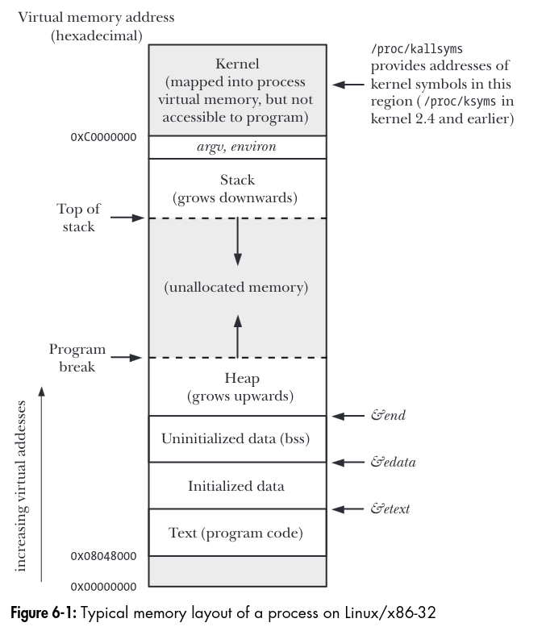
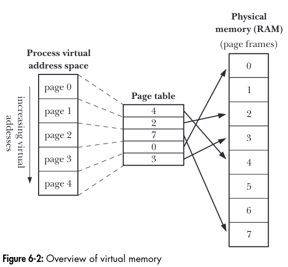

# Processes

Prev:
[file-io-further-details](file-io-further-details.md) Next: [memory-allocation](memory-allocation.md)

## Processes and Programs

A process is an instance of an executing program. A program is a file containing information that describes how to construct a process at run time. Programs have information that describes how to construct a process at run time like:

- Binary format identification: Each program file includes a metadata header that describes the format of the executable file. The current format is ELF on linux.
- Machine language instructions: The instructions the process will run.
- Program entry-point address: The location of the instruction at which execution of the program should commence.
- Data: The constants (like variables and literals) that the program uses.
- Symbol and relocation tables: The location and name of functions used by the program, used for debugging and run-time symbol resolution.
- Shared library and dynamic-linking information: the shared libraries the program needs to use at run time and the linker used to load those libraries.

A program can be used to construct many processes.

## Process ID and Parent Process ID

Each process has a process ID, a PID, which uniquely identifies the process on the system. `getpid` returns the process ID of the calling process.

```c
#include <unistd.h>

pid_t getpid(void); // Always successfully returns process ID of called
```

The Linux kernel limits process IDs to being less than or equal to 32,767.

To get the parent process id, `getppid` can be used.

```c
#include <unistd.h>
pid_t getppid(void); // Always successfully returns process ID of parent of caller
```

## Memory Layout of a Process

The memory layout of a process has many segments, or parts.

- The **text segment** contains the machine-language instruction of the program run by the process. This is read-only.
- The **initialized data segment** contains global and static variables that are initialized.
- The **uninitialized data segment** contains global and static variables that are not explicitly initialized.
- The **stack** is a dynamically growing and shrinking segment containing stack frames, which contain functions, variables, arguments, and the return value.
- The **heap** where programs can be dynamically allocated at run time.

## Virtual Memory Management

Linux uses virtual memory to layout processes, which looks like this:



A virtual memory scheme splits the memory used by each program into smaller, fixed-size units called pages. RAM is divided into series of page frames of the same size.

The kernel maintains a page table for each process, which contains the location of each page in the processes' virtual address space.



If a process tries to access memory without a corresponding page-table entry, it receives a `SIGSEGV` signal.

## The Stack and Stack Frames

## Command-Line Arguments (argc, argv)

## Environment List

## Performing a Nonlocal Goto: `setjmp` and `longjmp`

Prev:
[file-io-further-details](file-io-further-details.md) Next: [memory-allocation](memory-allocation.md)
