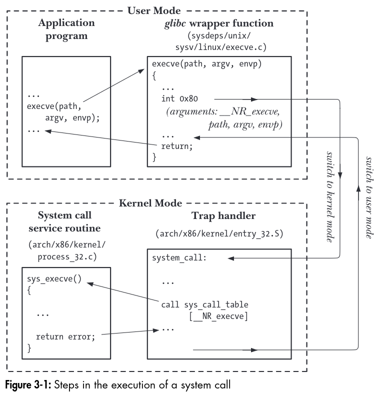

# The Linux Programming Interface

Prev: [fundamental-concepts](fundamental-concepts.md) Next: [file-io-the-universal-io-model](file-io-the-universal-io-model.md)

## System Calls

A system call allows a process in user space to request that the kernel takes some action in kernel space on the process' behalf.

Some points:

- A system call changes the processor state from user to kernel mode.
- The set of system calls is fixed, and each system call is identified by a unique number in Linux. To add a new system call, you can recompile the kernel.
- Each system call can take arguments which are passed to kernel space along with the system call.

The lifecycle of a system call might look like the following:

1. The application makes a system call by invoking a wrapper function in the C library
2. The wrapper function passes the arguments provided in the right place to the system call trap-handling routine.
3. The wrapper function places the identifying system call number in an ISA determined register, like `%rax` for x86_64.
4. The function executes a trap instruction `syscall` or `int 0x80`, which causes the processor to switch from user mode to kernel mode.
5. The kernel invokes code that responds to a system call.
    1. The kernel saves register values onto the kernel stack.
    2. The kernel validates the system call number and its argument(s).
    3. The kernel calls the system call asked by the process.
    4. The kernel restores register values from the kernel stack to the register.
    5. It returns to the wrapper function, and returns to user mode.
6. If the system call routine ran indicated an error, then it sets the global variable errno.

System calls have some overhead, as they require a lot more work than a simple user space function.

In graphical form:



## Library Functions

A library function is a function that is provided by the C standard library.

## The Standard C Library; the GNU C Library (glibc)

Most applications require the C standard library. One popular implementation is GNU's, glibc. The current version is called `libc.so.6`. You can check the dependencies of a program with `ldd`, list dynamic dependencies.

To test for the glibc version, there is a static way and a dynamic way of doing so:

A static way involves reading the constants `__GLIBC__` and `__GLIBC_MINOR__`, which return two numbers that indicate the major and minor version of glibc.

At runtime, you can use:

```c
#include <gnu/libc-version.h>

const char* gnu_version = gnu_get_libc_version();
```

Which returns a pointer to a null terminated string that has the glibc version.

## Handling Errors from System Calls and Library Functions

Some system calls (like `getpid` or `_exit`) never fail, but almost all other system calls can.

To check the system call for errors, you can check if the return code is `-1`.

```c
int fd = open(pathname, flags, mode);
if (fd == -1) {
    // handle the error
}
```

When a system call fails, it sets the integer value `errno` to a positive value. After including it, you can check for errors like:

```c
#include <errno.h>

count = read(fd, buf, nbytes);
// error happened
if (cnt == -1) {
    if (errno == EINTR) {
        fprintf(stderr, "read was interrupted by a signal.\n");
    } else {
        fprintf(stderr, "other error.\n");
    }
}
```

The `perror` function prints the string passed in, as well as a message corresponding to the value of `errno`.

```c
#include <stdio.h>

fd = open(pathname, flags, mode);
if (fd == -1) {
    perror("open");
    exit(EXIT_FAILURE);
}
```

If you want a string corresponding to the error in `errno`, you can pass it to `strerror`. The error messages are locale sensitive.

```c
#include <string.h>

char* strerror(int errnum);
```

## Portability Issues

Since some features aren't always available everywhere, a set of feature macros are popularly used.

One way to activate macros is to define them before including header files like so:

```c
#define _BSD_SOURCE 1
```

Or you can pass them to the compiler:

`$ cc -D_BSD_SOURCE main.c`

Some example macros include:

- `_POSIX_C_SOURCE` This sets the version of POSIX compatibility to use.

- `_XOPEN_SOURCE` This exposes Sus macros.

Some glibc exclusives:

- `_BSD_SOURCE` causes BSD definitions to be favored
- `_SVID_SOURCE` exposes System V definitions
- `_GNU_SOURCE` exposes both BSD and SysV definitions, as well as GNU exclusive macros

### System Data Types

Some data types don't use C specific types like `int` or `long` since they vary by the word size on the processor. Thus, there are some wrapper types used for important system data types, like process ids:

```c
typedef int pid_t;
```

Standard types generally are in `<sys/types.h>`.

### Miscellaneous Portability Issues

Since different unix implementations may have some fields in a structure typedef'd in or out:

```c
struct sembuf {
    unsigned short sem_num;
    short sem_op;
    short sem_flg;
#ifdef _GNU_SOURCE
    short sem_extras; // some extra flags for GNU only
#endif
};
```

You cannot use a structure initializer portably:

```c
struct sembuf s = { 3, -1, SEM_UNDO }; // this doesn't work
```

You can use the C89 compliant:

```c
struct sembuf s;

s.sem_num = 3;
s.sem_op = -1;
s.sem_flg = SEM_UNDO;
```

Or the C99 named structure initializer feature:

```c
struct sembuf s= { .sem_num = 3, .sem_op = -1, .sem_flg = SEM_UNDO };
```

To use features that might not be on all implementations, you can use `#ifdef`.

```c
#ifdef WCOREDUMP
    // use WCOREDUMP() macro
#endif
```

Prev: [fundamental-concepts](fundamental-concepts.md) Next: [file-io-the-universal-io-model](file-io-the-universal-io-model.md)
