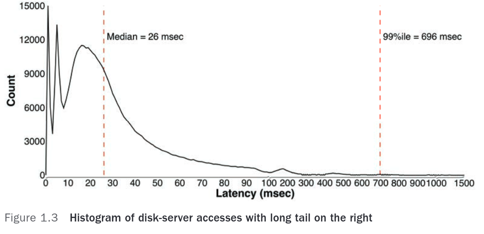
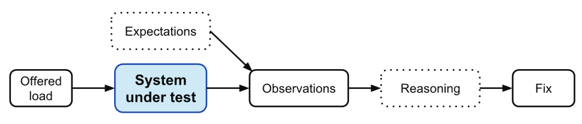

# Measurement

Next: [my-program-is-too-slow](my-program-is-too-slow.md)

Before beginning performance optimization, you should know how long an
operation should take: You can't diagnose performance problems if you
don't know if they are fixable.

Latency = time to complete unit of work
Throughput = units of work completed / time

Tail latency = slowest transactions in a distribution

In server side software, we generally favor a slower average request with a
narrower distribution than a faster average with a wider distribution,
because it is harder to predict.

Since a request may be broken down into a hundred different parts,
executing them in parallel is important, and tail latency is extremely
important to minimize:

In this case, the average, min, max, median are all less useful.

Histograms are more useful, where they measure percentiles.

The author fixed this graph by making the 99th percentile 150
milliseconds, paying for 10 years of salary.

To diagnose performance related issues, first we estimate how long an
operation should take, then observing how long it takes, and then
finding the differences:

Some transactions may only sometimes be slow because it is waiting on a
response from a lower layer.

Thus, we always need to find the slowest lower layer and fix that.

We can test a specific transaction by isolating it and giving it some
mock data, preferably from production and then monitoring it.

The most interesting case, where a normal RPC is slow, and only happens
in production, requires good instrumentation that has less than 1%
overhead.

The five fundamental resources shared between unrelated programs running
on a single server are:

1. CPU
2. Memory
3. Disk
4. Network

With cooperating threads:

5. Critical sections

To debug performance regressions, start off by measuring the five
fundamental resources -- if contention is high, performance suffers.

## Summary

- Understand occasionally slow RPCs
- For 100 RPCs done in parallel, the 99th percentile time sets the
  overall response time
- Datacenter software is rife with execution skew -- a long tail of
  substantially slower responses.
- Slower transactions means that something is interfering with the RPC.
- Interference comes from sharing the five fundamental resources
- Interference is hard to observe in situ; strong observation tools are
  required
- Order of magnitude estimates spot unexpected run times.

Next: [my-program-is-too-slow](my-program-is-too-slow.md)
