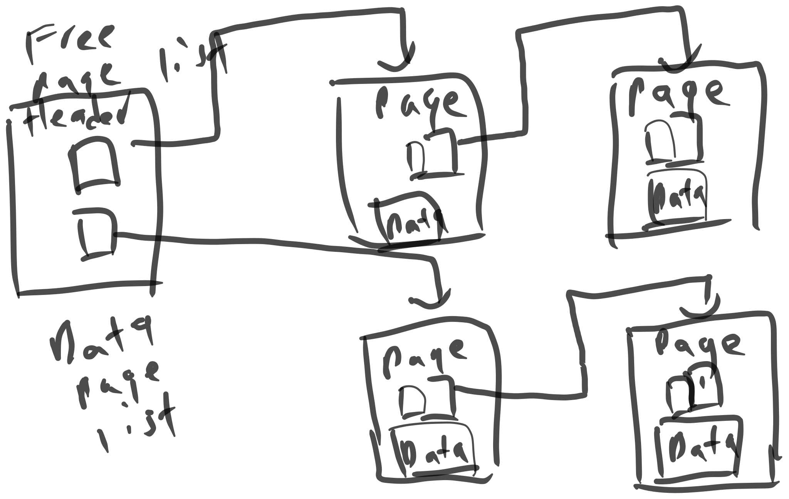
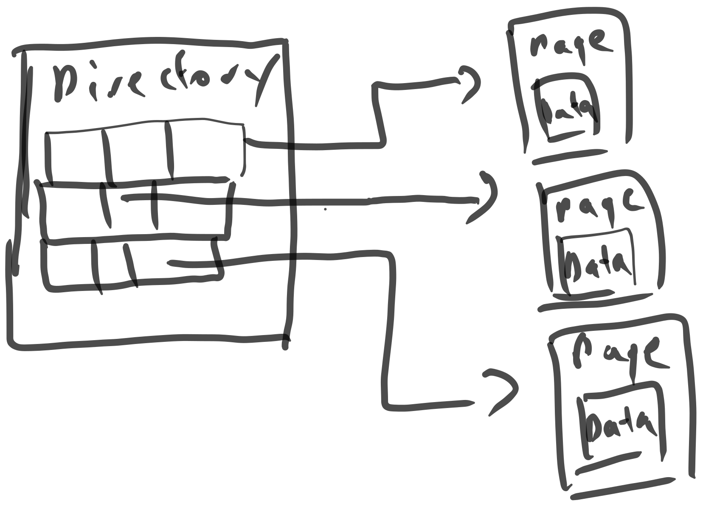
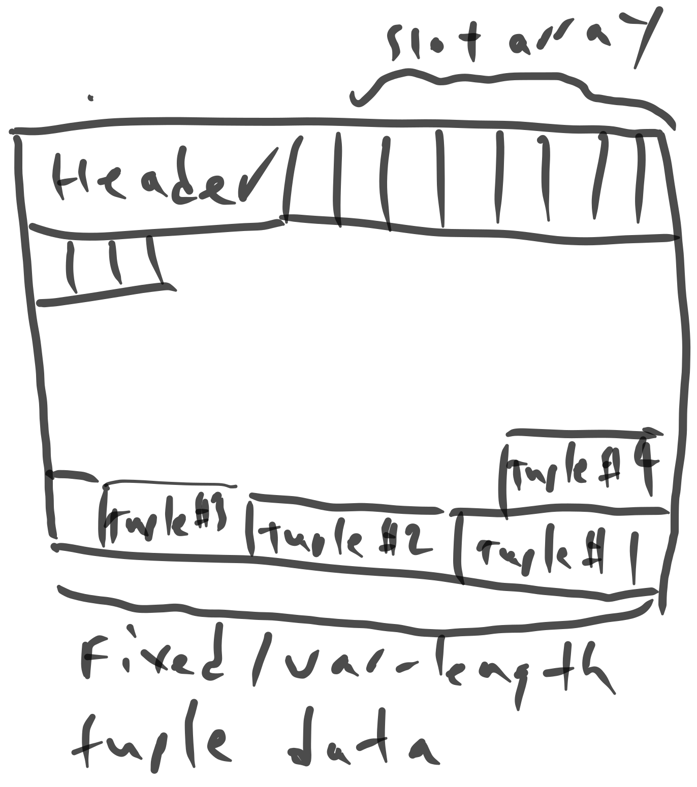
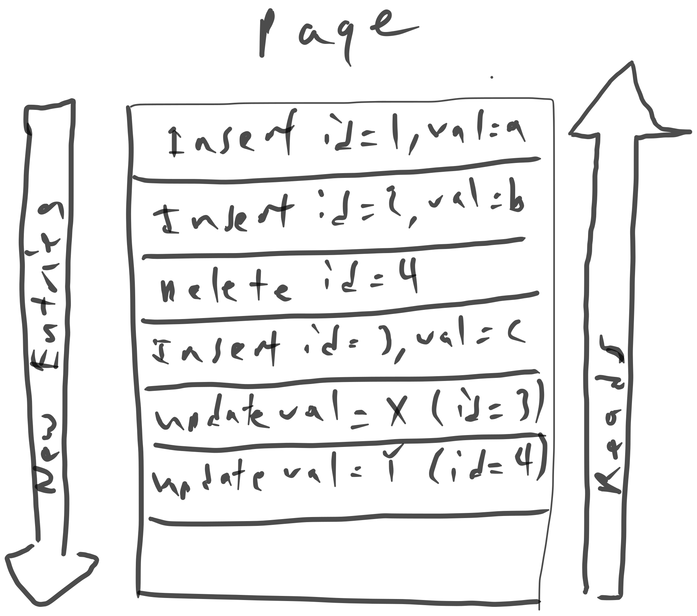

# Database Storage I

Prev: [[02-advanced-sql]]
Next: [[04-database-storage-ii]]

## Storage

This course focuses on disk-oriented DBMSes, so in-memory databases are out.

**Volatile Devices**:

- Volatile devices cannot persist data without power.
- Fast random access with byte-addressable storage.
- called "memory" informally.

**Non-Volatile Devices**:

- Non-Volatile devices can persist data without power.
- Block/Page addressable, so reads and writes are done in chunks (normally 4KB, but configurable).
- Non-volatile storage is traditionally better at sequential access.
- called "disk" informally.

There are some devices called `non-volatile memory` that are as fast as RAM but persistent. Intel's Optane is an example of this.

The DBMS will do manipulations in memory and then ship it out to disk.

## Disk-Oriented DBMS Overview

The DBMS maintains a buffer pool that moves pages between memory and disk. The DBMS also has an execution engine that will execute queries. It will ask the buffer pool for a specific page, and the buffer pool will take care of bringing that page into memory and giving the execution engine a pointer to the page in memory.

## DBMS vs. OS

The DBMS must support databases that exceed the amount of memory available. Also, since reading/writing to disk is expensive, it must be managed well.

The high-level design goal is similar to virtual memory. You can use `mmap` for this, by mapping the contents of a file in a process' address space, but if the OS gets a page fault, this blocks the process.

1. `mmap` should not be used for DBMS' if writing
2. The DBMS can control page flushing better than the OS.

`mmap` can advise the OS with the following:

1. `madvise`: Tell the OS when you are planning on reading certain pages.
2. `mlock`: Tells the OS to not swap memory ranges to disk.
3. `msync`: Tells the OS to flush memory ranges to disk.

## File Storage

The DBMS will write files on disk (normally in some binary fashion). Only the DBMS knows how to decipher their contents. The DBMS's storage manager is responsible for managing the database's files.

## Database Pages

The DBMS organizes the database across fixed-size blocks called pages. Pages may contain data (metadata, tuples, indexes, etc). Most systems will not mix these types, and some will require that they are self-contained, meaning all information needed to read the page is on the page itself.

Each page is given a unique identifier. The DBMS generally has an indirection layer that maps a page id to a file path and offset. The storage manager will turn a page number into a file and offset to find the page.

Most DBMS' use fixed-size pages to avoid engineering overhead.

There are three types of pages:

1. Hardware Page (Normally 4KB)
2. OS Page (Normally 4KB)
3. Database page (1-16KB).

The storage device generally guarantees atomic writes of hardware pages -- if the database's page size is larger than the hardware's page size, care needs to be taken to ensure that data gets written out safely, since the program can crash partway through writing a database page to disk.

## Database Heap

The database heap can find the location of the page a DBMS wants on disk in a few ways:

1. **Linked List**: the header page holds pointers to a list of free pages and a list of data pages. If the DBMS is looking for a specific page, it does a sequential scan on the data page list until it finds the page it is looking for.

2. **Page Directory**: The DBMS maintains special pages that track locations of data pages along witht he amount of free space on each page.

## Page Layout

Every page includes a header that records metadata about the page's contents:

- Page size
- Checksum
- DBMS version
- Transaction visibility

There are two main ways to laying out data in pages:

**Slotted Pages**:
- The page maps slots to offsets
- The header keeps track of the number of used slots and the offset of the starting location of the last used slot and a slot array, which keeps track of the location of the start of each tuple.
- To add a tuple, the slot array will grow from the beginning to the end, and the data of the tuples will grow from the end to the beginning. The page is considered full when the slot array and the tuple data meet.

**Log-Structured**:
- Stores records to file of how the database was modified (insert, update, deletes)
- To read a record, the DBMS scans the log file backwards and "recreates" the tuple.
- Fast writes, potentially slow reads.
- Works well on append-only storage, because the DBMS cannot go back and update the data.
- To avoid long reads, the DBMS can have indexes to allow it to jump to specific locations in the log, and also compact it.

## Tuple Layout

**Header**: Contains metadata about the tuple.
- Visibility information for the DBMS' concurrency control protocol
- Bit Map for NULL values.

**Data**: Data for attributes
- Attributes are stored in the order that you specify them when you create the table.
- Most DBMS's do not allow a tuple to exceed the size of a page.

**Unique Identifier**: Identifier for tuple
- Each tuple has a unique identifier.
- Commonly (page_id + offset)
- An application cannot rely on these ids to mean anything.

Prev: [[02-advanced-sql]]
Next: [[04-database-storage-ii]]
