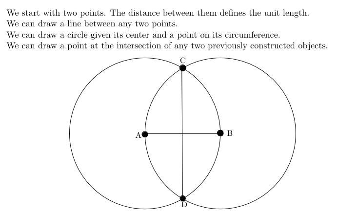

# Introduction

Next: [[02-logic]]

## What is computer science?

Computer science isn't programming. It's a mathematical set of ideas for understanding systems: brains, universes, living organisms, computers.

We work our way up from the simplest systems and build more complicated systems on top of it.

## Student Calibration Questions

A quine is a program that prints itself out.

For example:

Print the following twice, the second time in quotes.
"Print the following twice, the second time in quotes."

There are more real numbers than integers, even though there are the same number of integers ars even integers.

## How do you run an online gambling site?

Imagine you're playing roulette. Half the slots are red, half are black. If you bet correctly, you get *n* dollars. If you bet incorrectly, you lose *n* dollars.

Imagine this sequence of events, where the casino declares their bet afterwards:

Player: I bet on red.
Casino: The ball landed on black. You lose.
Player: I bet on black.
Casino: The ball landed on red. You lose.
Player: I bet on black.
Casino: The ball landed on red. You lose.
Player: I bet on red.
Casino: The ball landed on black. You lose.
Player: This #$%ˆıng game is rigged!

We could try the other way, where the player declares their bet afterwards:

Casino: The ball landed on black.
Player: That’s funny, I bet black!

So both sides need to declare their bets beforehand, exchange them, and then be able to verify the bet without being able to change their bet afterwards.

One way to do this is to use a trusted third party. Another way is to use a cryptosystem, like RSA.

## Factoring is Hard

Multiplying two numbers is easy. The naive way takes $N^2$ steps for two N-digit numbers, but there are algorithms that can multiply in close to $N \log{N}$ time nowadays.

However, factoring is hard. If a number, $X$, is $N$ bits long, there are $2^N$ factors to try. Even if we factor only to the square root, that requires $2^N/2$ factors.

The fastest algorithm is a number field sieve, which is roughly $N^{1/3}$, not much better.

This is a one way operation: The forward operation (multiplication) is doable in Polynomial time: ($N log N$ time). The reverse operation, factoring, takes exponential time: ($N^{1/3}$).

With this, we can try to solve the gambling problem:

Have the player bet on red by picking two primes that don't end in 7 and multiply them together. To bet on black, the player picks two primes, where at least one ends in 7 and multiplies them together.

The protocol would look like this:

Player: sends X to the casino.
Casino: announces red or black.
Player: reveals factors to casino.
Casino: checks that factors multiply to X.

Can either side cheat? The player can, for example. If they choose factors $A$, $B$, $C$ that end in 1,3,7. If the casino announces red, the player sends the numbers $AB$ and $C$.
If the casino announces black, the player sends over $A$ and $BC$. Thus the player can always win. However, the casino just needs to change one rule:

Since checking if a number is prime or composite is doable in polynomial time, you need to modify the last step to be:

"Casino checks that the factors are primes which multiply to X."

There are some other great ideas in theoretical CS, like zero-knowledge proofs, where you can convince someone of a fact without giving away anything about the proof.

## Compass and Straightedge

The greeks were interested in drawing figures using just a compass and straightedge. You can construct lots of things, like a perpendicular bisector of a line segment.

However, you cannot do certain operations with just these rules. For example, you cannot square a circle, trsiect an angle, or double a cube.

### Doubling a Cube

Doubling a cube involves this: given the side length of a cube, and asked to construct the side length of a new cube that would have twice the volume of the old one.

Basically, given some line, construct a new line segment of length $\sqrt[3]{2}$. You can approximate this arbitrarily well, but there is no exact construction with just a straightedge and compass.

But this is still a linear system. Even with the cartesian plane, a quadratic system, we still cannot, since we can only use roots, not cube roots.

Basically, if we have the numbers 0 and 1, and the operations $+ - \times \div$ can we construct the number $\sqrt[3]{2}$? The answer is no.

This is applicable to CS because depending on the rules we choose, certain things are possible and certain things are impossible. We cannot express higher dimensions in lower dimensions, only approximations.

As well, it's impossible to express infinitely precise floating point numbers in binary, since base infinity is much more expressive than base 2.

## Euclid's GCD Algorithm

How do we reduce a fraction like 510/646 to its lowest terms?

The naive way is to use factoring. But factoring is NP-hard. Euclid's GCD algorithm involves the observation that if a number divides two numbers, it also divides any integer linear combination of them, like 646 - 510.

This is because if we divide B by A, we get a quotient *q* and a remainder *r* that is expressed by the equation: $B = qA + r$, or $r = B - qA$.

So, finding the GCD of two numbers, A and B is the same as finding the GCD of the smaller number and the remainder when we divide them.

So, Euclid's GCD algorithm works like this:

Given two numbers A, B.
take the minimum, and swap it to B.
If A is 0, return B
Else return GCD of (B % A) and A.

Thus, each step gets exponentially smaller. This is much better than having to do an NP-hard algorithm!

Next: [[02-logic]]
