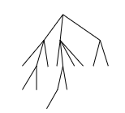

# Reducibility and Gödel

Prev: [[05-minds-and-machines]]
Next: [[07-polynomial-time]]

## Review Turing Machines

Turing machines can go backwards and forward on their tape, and write to tape and decide when to halt. Any turing machine can also emulate any other turing machine by encoding a description of the other turing machine on its tape.

The Church-Turing thesis says that any computable problem can be solved by a Turing Machine. However, no turing machine can solve by halting problem, and that there are way more unsolvable problems than solvable ones.

## Oracles

An oracle is a device that would solve a computational problem without cost. We can use them to solve unsolvable problems or problems we don't know how to solve.
Thus, assuming that we can have oracles solve those unsolvable problems, we can create a hierarchy of unsolvable problems, to show which problems are harder than others to solve.
It can tell us that certain problems are not solvable, because they can be reduced to other unsolvable problems.

To model oracles, recall the definition of a Turing Machine:

$$ A : \{0, 1\}* \rightarrow {0, 1} $$

Where the input is any string of any length and the output is a 0 or 1 answering the problem:

$$ M^A $$

We can show a Turing machine *M* with access to oracle *A*. Assume *M* is a multi-tape Turing machine and one of its tapes is a special oracle tape. *M* can ask a question, a string *x* for the oracle, and the oracle will answer *A(x)* on the tape.

Thus, given two problems *A* and *B*, *A* is reducible to *B* if there exists a Turing machine *M* such that $M^B$ solves *A*. This is denoted with $A \le_T B$.

### Diophantine Equations

Given:

$$ x^n + y^n = z^n $$
$$ n \ge 3 $$
$$ xyz \ne 0 $$

is there a solution in just integers?

There is no solution with just integers.

We could try every possible solution $(x, y, z, n)$ in order, and try them all, and pause when we find the solution.

However, if there is no solution, it would go on forever. Thus the question to the oracle is: "Does this program halt or not?"

So if we could solve this, there would also be an algorithm for the halting problem. They are reducible to each other.

### Tiling the plane

Given some finite collection of tiles of all different shapes, can we fill an entire plane just using those tiles? Assume that all are 1x1 squares with different shaped notches:

The halting problem is reducible to this problem: if you could createa  set of tiles that would only link together, that encodes the actions of a Turing machine.
If the machine halts, then you wouldn't be able to add any more tiles. Thus the plane would only be tiled if the machine runs forever.

**Konig's Lemma**

Assume you have a tree with two assumptions:

1. Every node has at most a finite number of children, $[0, \infty]$
2. It is possible to find a path in the tree going down any finite length you want.

Claim: The tree has to have a path of infinite length.

We claim that the tree has infinite length, because if it were finite, there would exist a longest path. There are a finite number of subtrees at the top level.
We'll start at the top and move to whichever node has infinitely many descendants. There has to be at least one of them. And this goes on recursively.

Konig's Lemma tells us that the tree has to have an infinite path, which means we can tile the infinite plane. Thus, the tiling problem is reducible to the halting problem.

## Turing degrees

A turing degree is a maximal set of all problems reducible to each other.

So there are two degrees: Computable problems and problems equivalent to the halting problem.

We could give a Turing machine with an oracle for the halting problem and asked do you halt? This could be a higher degree halting problem.

There was an open problem called "Post's Problem" which was solved to show that there is something between Computable problems and the halting problem. But it's rare in practice.

## Godel's Incompleteness Theorem

Godel's incompleteness theorem shows that there are limits to systems of logic.

**First Incompleteness Theorem**: Given any system of logic that is consistent and computable, there are true statements about integers that cannot be proven or disproven by the system.
These statements are hypothetically provable, but if you want to prove them, you need a more powerful system, and that system also has statements that can't be proven as well, recursively.

**Second Incompleteness Theorem**: No consistent, computable system of logic can prove its own consistency. It can only prove its own consistency if it's inconsistent.
Godel proved this by starting with "this sentence is not provable". If the sentence is false, then the sentence is provable, and is a provable falsehood.
This can't work in a consistent system of logic.

This can be modeled like so, with *S* being a logical system:

$$ G(S) = "This sentence is not provable in S" $$
$$ Con(S) = "S is consistent" $$

With the claim $Con(S) \implies G(S)$, we can test out if $G(S)$ were false and true.

If it was false, then *S* would be inconsistent because it would prove a falsehood.
If it were true, then $G(S)$ would also be provable, and thus S would prove a falsehood. Thus, $Con(S)$ is not provable in *S*.

Prev: [[05-minds-and-machines]]
Next: [[07-polynomial-time]]
