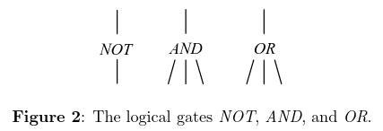
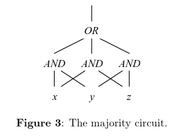
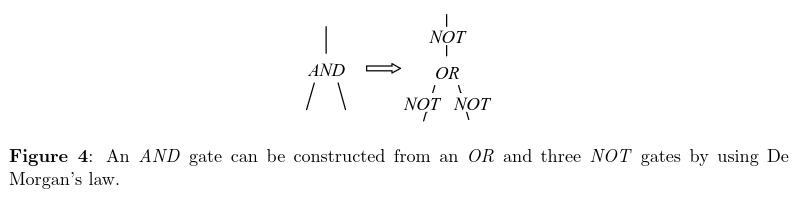
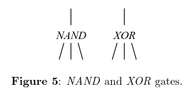
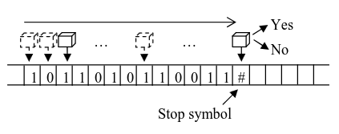
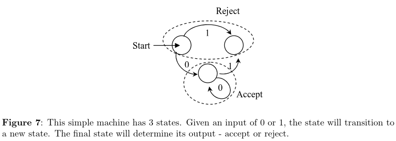
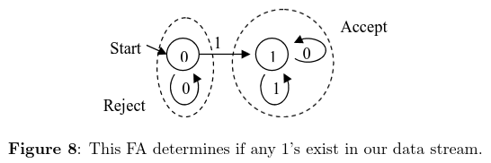
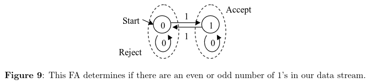
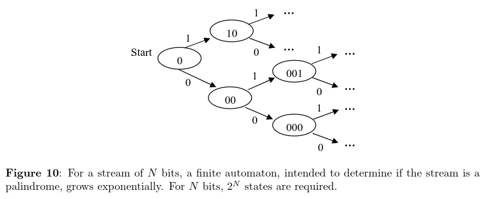
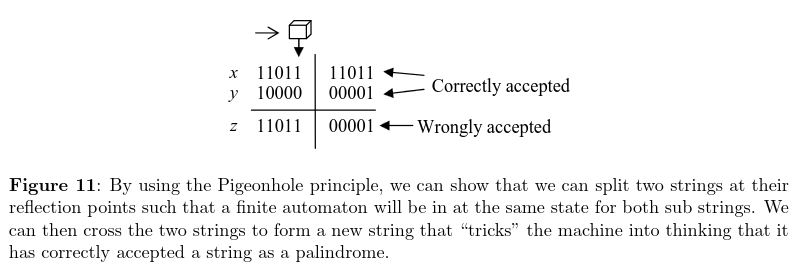

# Circuits and finite automata

Prev: [logic](logic.md)
Next: [turing-machines](turing-machines.md)

## Recap

### Computer science as a set of rules

Computer science can be thought of as the study of a simple set of rules and what you can and can't build with them.

### Logic

Logic involves representing rational thought itself. If our thought could be represented by a sequence of symbols and manipulations on those symbols, then we can program a computer to do reasoning for us.
Syllogisms and propositional logic, and others.

### First order logic

First order logic is built up of sentences. Each sentence contains variables, like *x*, *y*, and *z*. As well, we can define functions which take these variables as input. Quantifiers allow us to state propositions:

For example, every positive integer x is either prime or composite:

$$ \forall x Prime(x) \vee Composite(x)$$

This isn't true, of course. 1 is both prime and composite.

We can also say there exists an *x* such that something is true:

$$ \exists x Something(x) $$

### Inference rules

We want a set of rules that allow us to form true statements from other true statements.

Propositional tautologies:

$$ A \vee \neg A$

Modus ponens:

$$ A \wedge (A \implies B) \implies B $$

Equals:

$$ Equals(X, X) $$
$$ Equals(X, Y) \iff Equals(Y, X) $$

Transitivity property:

$$ Equals(X, Y) \wedge Equals(Y, Z) \implies Equals(X, Z) $$

### Quantifier rules

If $A(x)$ is a valid sentence for any choice of $x$, then for all $x$, $A(x)$ is a valid sentence. Conversely, if $A(x)$ is a valid sentence,
for all $x$, then any $A(x)$ for a fixed $x$ is a valid sentence.

$$ A(X) \iff \forall x A(x) $$

If $A(x)$ is false for all $x$, $A(x)$ $\iff$ there exists an $x$, $\neg A(x)$.

$$ \neg \forall x A(x) \iff \exists \neg A(x) $$

### Completeness theorem

Kurt Godel proved that these rules are all that's required. If one could not derive a logical contradiction with this set of rules, there must be a way of assigning variables
such that all sentences are satisfied.

## Circuits

In CS, circuits have no loops and are built with logic gates

### Logic Gates

The three best known logic gates are *NOT*, *AND*, and *OR*.

We can design a circuit that takes the majority of three variables, $x$, $y$, and $z$.

Or an AND gate from OR and NOT:

With NAND we can create any other gate:

Interestingly, with only AND and OR, we can only ever create a monotone boolean function, since if there are only 1s we cannot ever make a 0, or vice versa.

with XOR and NOT, we can never get functions like AND and OR.

## Puzzle

Can you compute the NOT's of 3 input variables, using as many AND/OR gates as you like, but only 2 NOT gates?

Since AND and OR are monotone, we need at least 3 NOT gates for this.

### Limitations

While powerful, circuits lack storage. They also have no feedback, so you cannot feed a circuit's output as input to another circuit.

But their biggest limitation is that they can only be designed for a single task. If a circuit can sort 100 numbers, another circuit needs to be design to sort 1000 numbers. There's no general purpose circuit for a task, such as sorting.

And we don't just want to do sorting, either.

## Finite Automata

Finite Automata are a model of computation that can handle inputs of arbitrary length. However, it comes with its own limitations.

### Description

A finite automata has some unique state, where the machine reads the tape from left to right, and the state changes depending on the value of the current square.
When it reaches the stop state (the # sign), the machine returns either 1 or 0, depending on its state.

### State and internal configuration

This simple machine has 3 states: START, ACCEPT, REJECT. It can transition to a new state given an input of 0 or 1. Finally, it returns either 0 or 1, accept or reject.

If this machine had infinitely many states, it could compute anything, so it is important that it has finite states.

### Some examples

Imagine a machine that determines if any 1's exist in a stream given an alphabet of 0 or 1. There are two states in the machine. 0 if it has seen no 1s, and 1 if it has.

Thus, there is only ever one transition, and after the machine has transitioned to 1, it can never leave. This would look like the following, and always gives the correct answer:

Another machine could be one that determines if the number of 1s is even or odd in the stream. If the machine returns 0, there are an even number of 1s, and if the machine returns 1, an odd number.

This would look like the following, and always return the correct answer:

### Palindromes

Can we create a machine that determines if an input string of 0s and 1s is a palindrome? Sadly, no.

### The Pigeonhole Principle

The pigeonhole principle states that with N pigeons and N - 1 holes, at least one hole must have two or more pigeons.

### Proving the pigeonhole principle

To prove the pigeonhole principle is very hard in propositional logic. It's intuitive with a higher level understanding of logic, but not otherwise.

### Using the pigeonhole principle for palindromes

First, we create two strings, x and y that are palindromes, split them in the middle, and create a new string, z, with half of x and half of y.

This tricks the machine into accepting more palindromes than there are.

A finite automaton must have a fixed number of states. However, there are infinitely many possibilties for the first and last half of the string. Thus, with the pigeonhole principle, we cannot put infinite pigeons into finite holes.
Thus, this automaton cannot correctly determine only palindromes.

### Regular expressions

Regular expressions and finite automaton are computationally the same thing. Any language is expressible by a regular expression, if it's recognized by a finite automaton.

## Nondeterministic finite automata

Nondeterministic finite automata represent machines that can transition between states and sets of states.

NFA's can be emulated with a DFA with $2^N$ states, so NFAs are not more powerful than DFAs.

Prev: [logic](logic.md)
Next: [turing-machines](turing-machines.md)
