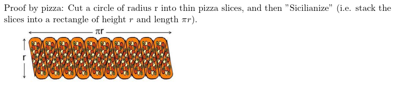

# Logic

Prev: [introduction](introduction.md)
Next: [circuits-and-finite-automata](circuits-and-finite-automata.md)

## Review of Last Lecture

Some people argue that math is just a cultural construct, but this seems odd given that the Greeks, Mayans, Indians, Chinese, etc. all independently discovered the same ideas.

Geometry in general was known by these societies for many uses.

For example, there are many ways to calculate the value of $\pi$. One involves using randomness on a cartesian plane. Another way involves sicilian pizza argument:

Take a pizza, with a radius $r$, and cut it into thin slices, and then sicilianize them (stack them into a rectangle of height $r$, and length $\pi r$.

## Today: Logic and Proof

Logic is a building block to everything else in the course.

One concept is the syllogism.

All men are mortal, Socrates is a man, therefore Socrates is a mortal.

Basically, If $A \implies B$ is valid and $B \implies C$ is valid, then $A \implies C$ is valid.

$\implies$ means that if A is true, B has to be true. If A is false, B could be either true or false.

Therefore, false statements don't really imply anything.

Imagine you're a bouncer at a bar, and you need to make sure everybody drinking is over the age of 21. Who do you check? You check the union of drinkers and people under the age of 21, and kick them out.

### 2.1 Leibniz and the Calculs Ratiocinator

Leibniz wanted an automatic reasoning machine to settle legal disputes. This was fairly naive, because court cases aren't deterministic. However, what he wanted fits great with computers, which are more deterministic.

In court cases, people don't agree about the facts, or they could be probabilistic, or they don't agree about the weight of the facts, and laws can be vague, and interpreted different ways.

Your machine doesn't think, but is a bunch of gears that do actions. The whole system does a lot more than its gears.

The simplest system of thought is where every statement has the form:

- $A \implies B$
- $\neg A \implies B$
- $A \implies \neg B$ or
- $\neg A \implies \neg B$

With the rules:

- Where $A \implies B$ and $B \implies C$, $A \implies C$.
- Where $\neg A \implies A$ and $A \implies \neg A$, there is a contradiction.

Consider this example:

- $A \implies B$
- $\neg C \implies A$
- $\neg A \implies \neg C$
- $B \implies \neg A$

These sentences cannot all be satisified. We can think about this as a graph, where $A \implies B$ and $B \implies C$ is a graph of $A \arrow B \arrow C$.
Likewise, if we can get to an edge where we go from $A \implies \neg A$, then we're done, since this proves a contradiction.
In the logical system above, $A \implies B$ so we can go from $A$ to $B$. However, $B \implies \neg A$, so $A \implies \neg A$, which is a contradiction.

There are two properties of logical systems:

*Soundness*: Any statement you get by following the rules is true.
*Completeness*: You can get to any true statement by following the rules.

Prev: [introduction](introduction.md)
Next: [circuits-and-finite-automata](circuits-and-finite-automata.md)
