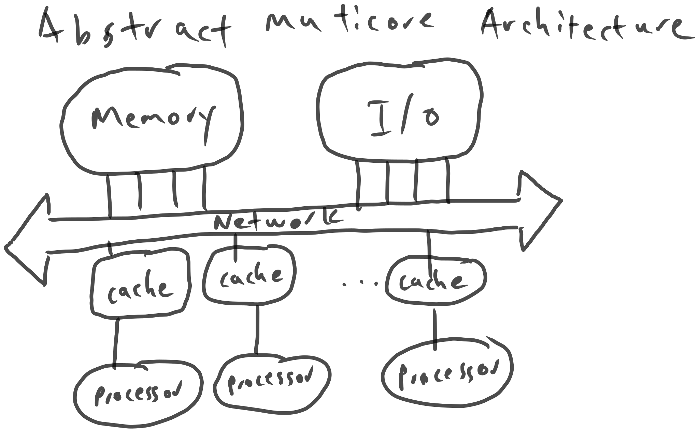

# Multicore Programming

Prev: [[05-c-to-assembly]]
Next: [[07-races-and-parallelism]]

## Multicore Architecture

The multicore architecture might look like this:

## Cache Coherence

Since we have so many caches, we need to have a way to label which values in each cache are up to date thorughout the set of processors. One could imagine an order of:

C1: Store x, 5;
C2: Load x;
C2: Store x = 6;
C1: Load x; // the cache is stale here

To do this, we can use the MESI protocol.

**M**: M stands for Modified. No other caches contain this block, and it has been updated, so it must be written to main memory before any other processors can read it.
**E**: E stands for Exclusive: No other caches contain this block, and it has not been updated, so it matches main memory. Any other processor can read it, changing this state to Shared.
**S**: S stands for Shared: Other cache lines contain this block, and it is clean: it matches main memory. Other processors can read it, but if they update it, this cache line will become Invalid.
**I**: I stands for Invalid: This cache line was once shared, but another processor has updated main memory, and the new value has not been fetched yet.

## Concurrency

Concurrency platforms include:

1. Pthreads and WinAPI
2. TBB
3. OpenMP
4. C++11 threads

### Pthreads

Pthreads are used on Unix platforms. They involve passing a function to a create function, and then joining the threads to wait for their concurrent execution.

They are somewhat expensive (take $\gt 10^4$ cycles to spawn), and remove modularity of the calling function, since it now needs to take in logic from the pthreads function.

### TBB (Threading Building Blocks)

TBB provides a work stealing threading model, as well as concurrent loops, concurrent container classes, and mutual exclusion libraries, like locks and atomics.

### OpenMP

OpenMP uses pragma directives to express common patterns.

### C++11 threads

C++11 has a threading model, which has since been ported to Rust and C. The standard library includes parallel looping algorithms, atomics, and the like. Libraries have been built for concurrent container classes as well.

Prev: [[05-c-to-assembly]]
Next: [[07-races-and-parallelism]]
