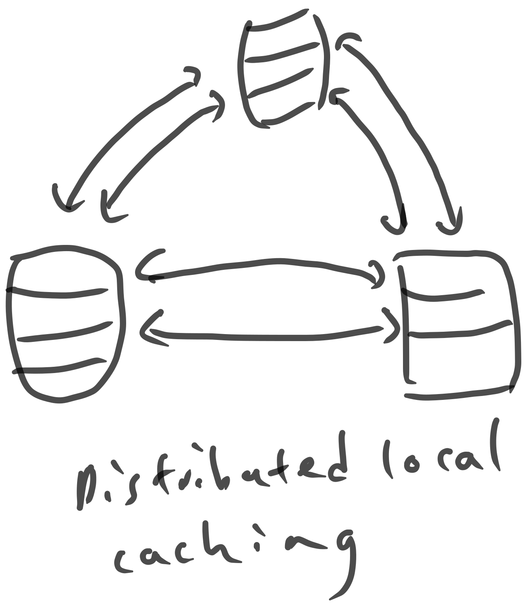
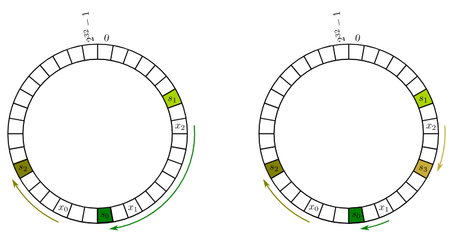

# Introduction Consistent hashing.

Next: [[02-property-preserving-lossy-compression]]

## Web Caching

Consistent Hashing was used for the web in 1997. Caches are straightforward -- if you've visited a site recently, keep a copy of it, and on the next visit, use that webpage. This is a good start, but what if we wanted a web cache that is shared by many users? If someone nearby has accessed `amazon.com`, you could just take their local copy.

A few problems include the amount of storage and the distributed nature of the problem, to have lots of users use the same cache.

If we want to query say 100 machines to see if it has an up to date copy of `amazon.com`, querying all 100 machines (even in parallel) is stupid. Each cache should own a chunk of the urls and their data.

## A Simple Solution Using Hashing

A first approach involves hashing each URL to a bucket, by first computing a 32-bit hash, and then modding it into a specific bucket.
Theoretical guarantees are possible for families of hash functions, where you pick a random hash function from a universal family of hash functions.
Say there are $n$ caches, named $\{0, 1, 2, ... n - 1\}$. We can calculate the cache to go to with the following formula:

$$h(x) {}\text{mod}{} n$$

However, since the number of caches is not static, (due to the fact that networked caches may disappear temporarily due to network partitions, or new caches could be added), adding a new cache would cause almost all objects to relocate. This is bad if $n$ is always changing.

## Consistent Hashing

Thus, we really want hash table like behavior, but while the amount of buckets are constantly changing.

The key idea involves hashing the names of all URLs, but also hashing the names of all cache servers as well, in a circle. Each item is then assigned to the hash server next clockwise to it.

This means that the expected load on each of the $n$ cache servers is exactly $\frac{1}{n}$. Also, adding the $nth$ cache only causes $\frac{1}{n}$ of objects to relocate. This is compared to the normal hash function solution, where when adding the $nth$ cache, only $\frac{1}{n}$ items don't move.

However, a regular hash table isn't good enough for consistent hashing -- you'll need a data structure that supports a fast successor operation, like a red-black tree, since you'll always want to maintain a total ordering of the items.

**Reducing Variance**: However, if we only hash each server once, there can be a lot of variance where a few servers get few items. Assuming that items are hashed uniformly throughout the input data, you could create $k$ virtual copies of each server hash, and assign them to $k$ locations on the hash map for caching. Choosing a $k \approx \log_{2}n$ should be large enough to obtain balanced loads.

Next: [[02-property-preserving-lossy-compression]]
