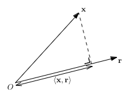

# Curse of Dimensionality

Prev: [[03-similarity-search]]
Next: [[05-generalization]]

The curse of dimensionality, where the time to query the nearest neighbor scales exponentially to the number of dimensions, seems to be fundamental to the problem of nearest neighbors.

For a better intution why: imagine we sort points on a 1D line. Well, to find the nearest neighbor, you have to go either left or right. In a 2D graph, you have four directions to check. In 3D, eight.

$$directions = 2^D$$

1. 1D -> 2
2. 2D -> 4
3. 3D -> 8
4. 4D -> 16

Every known solution that uses a reasonable amount of space uses time exponential to $k$, the number of dimensions, or linearly to $n$, the number of points.

We have to resort to approximation.

## Point of Lecture

The curse of dimensionality is a problem, because the natural representation of data is high-dimensional. Document similarity has $k$ dimensions to the number of unique words in the text -- tens of thousands, maybe millions. Images are represented as real vectors, which one dimension per pixel (so millions to billions). The same holds true for shoppers on amazon or viewers on netflix.

But we can't solve problems in high dimensions well, so we have to employ **dimensionality reduction**, representing points in high-dimensional space as points in lower-dimensional space, preserving interpoint distances as much as possible, so our calculations in lower-dimension space aren't that far off.

## Role Model: Fingerprints

Imagine that for objects that have no notion of distance outside of "equal" and "non-equal". How do we represent them with fewer bits, but with the same relation of equality preserved?

One way is to just hash each item to a 32-bit hash, but that takes 32-bits of memory.

One way to do better is to hash each item, then mod it by 2, so the result takes 1 bit (0 or 1).

$$f(x) = h(x) \text{ mod } 2$$

The properties of the mapping are:

1. If $x = y$, then $f(x) = f(y)$. Thus, equality is preserved.
2. If $x \neq y$, and $h$ is a good hash function, then $chance(f(x) = f(y)) \le \frac{1}{2}$.

So, there's a 50% error of equality. However, for a better accuracy rate, we use more hash functions.

If we repeat the experiment $l$ times, choosing a different hash functions from $h \in h_{1},\dots,h_{l}$, and labeling each object $x$ with $l$ bits consisting of $f_{1}(x),\dots,f_{l}(x)$, the properties become:

1. If $x = y$, then $f_{i}(x) = f_{i}(y)$ for all $i = 1,\dots,l$.
2. If $x \neq y$ and the $h_{i}$'s are good and independent hash functions, then $chance(f(x) = f(y)) \le 2^{-l}$.

To achieve an error rate of $\delta \gt 0$, we only need $\log_{2}\frac{1}{\delta}$ bits to represent each object.

## $L_{2}$ Distance and Random Projections

The fingerprinting subroutine above approximately preserves a 0-1 function on object pairs (equality). What about distances between object pairs? What's the analog of a hash for the euclidean distance?

$$\sqrt{\displaystyle \sum_{i=1}^k(x_{i}-y_{i})^2}$$

The high level idea involves **random projection**, which results in the **Johnson-Lindenstrauss** (JL) transform, which says that if we only care about the euclidean distance, we can assume the number of dimensions is only in the hundreds.

### High-level Idea

Assuming the $n$ objects are points $x_1,\dots,x_n$ in $k$-dimensional Euclidean space $\Bbb R^k$ where $k$ can be very large. Fix a "random vector" $r = (r_1,\dots,r_k) \in \Bbb R^k$. You can define a corresponding transformation function for r: $f_r: \Bbb R^k \to \Bbb R$, by taking the inner product of its argument with the randomly chosen coefficients r:

$$f_r(x) = (x, r) = \displaystyle \sum_{j=1}^k x_jr_j$$

Thus, $f_r(x)$ is a random linear combination of the components of x. It's like the hash function from the last section that compresses the $log_{2} U$-bit object into a single bit. The random projection above replaces a vector of $k$ real numbers with a single real number.

The random numbers $r_j$ are chosen randomly, with independent trials to reduce the error of the projection.

The inner product of $(x, r)$ will look like this:

## Review: Gaussian Distributions

Gaussian distributions are symmetric around their mean $\mu$, and 68% of its mass is within one standard deviation $\sigma$ of its mean. For any distribution, its square, $\sigma^2$ is the variance. A Gaussian distribution is completely and uniquely defined by the values of its mean $\mu$, and variance $\sigma^2$. The standard Gaussian (e.g. for IQ) is the case where $\mu = 0$ and $\sigma = \sigma^2 = 1$.

Gaussian distributions are useful for dimensionality reduction because of a few properties:

Their closure under addition, means that the addition of two random variables in a set is in the set already. Suppose $X_1$ and $X_2$ are independent random variables with normal distributions $N(\mu_1,\sigma_1^2)$ and $N(\mu_2,\sigma_2^2)$. Thus, the random variable $X_1 + X_2$ has the normal distribution $N(\mu_1 + \mu_2, \sigma_1^2 + \sigma_2^2)$.

Neither point is necessarily interesting. The mean of $X_1$ + $X_2$ is always $mean(X_1, X_2)$, and the variance of $X_1$ and $X_2$ is always the sum of variances of $X_1$ and $X_2$ for any pair of independent random variables. If you sum two random variables that are uniform on $[0, 1]$, then the resulting distribution isn't uniformly distributed on $[0, 2]$. It would have more density around 0 to 1 than around 2. This is the central limit theorem in action.

## Step 1: Unbiased Estimator of Squared $L_{2}$ Distance

Returning to the random projection function $f_r$ with the random coefficients $r_1,\dots,r_k$, chosen independently from a standard Gaussian distribution, for every pair $x, y \in \Bbb R^k$, the square of $f_r(x) - f_r(y)$ is an unbiased estimator of the squared Euclidean distance between $x$ and $y$.

Fix $x, y \in \Bbb R^k$. The $L_{2}$ distance between $x$ and $y$, is $\|x - y\|_2$, or $\sqrt{\displaystyle \sum_{i=1}^k(x_{i}-y_{i})^2}$

Thus, $f_r$ would be:

$$f_r(x) - f_r(y) = \displaystyle \sum_{j=1}^k x_jr_j - \sum_{j=1}^k y_jr_j = \sum_{j=1}^k(x_j - y_j)r_j$$.

Since $r_j$ is random, and $x_j$ and $y_j$ are fixed, for each $j = 1,2,\dots,k$ since $r_j$ is a Gaussian with mean zero and variance 1, $(x_j - y_j)r_j$ is a Gaussian with a mean of 0 and a variance $(x_j - y_j)^2$, since multiplying a random variable by a scalar $\lambda$ scales the standard deviation by $\lambda$ and its variance by $lambda^2$. Since Gaussians add, the right-hand side is a Gaussian with mean 0 and variance of:

$$\displaystyle \sum_{j=1}^k(x_j - y_j)^2 = \|x - y\|_2^2$$

The variance thus is the square of the distance betwen neighbors. So we next need to find a way to take its root and save that in a lower dimensional space.

Since the variance of a random variable, $X$ is $Var(X) = E[(X - E[X])^2] = \|x - y\|_2^2$, this can be simplified to $X[X^2]$. Thus:

$$E[(f_r(x) - f_r(y))^2] = \|x - y\|_2^2$$.

Thus, $(f_r(x) - f_r(y))^2$ is an unbiased estimator of the squared Euclidean distance between x and y.

## Step 2: The Magic of Independent Trials

Using this random projection reduces the number of dimensions from $k$ to just 1, by replacing $x$ with $f_r(x)$. This preserves squared distances in expectation. However, we want to preserve distance, not squares of distance, and we want to almost always preserve distance closely.

To do this, we'll use independent trials.

Instead of picking a single vector $r$, pick $d$ vectors $r_1,\dots,r_d$. Each component of each vector is drawn independently and identically distributed from a standard Gaussian. Then, for each pair $x, y \in P$, we get $d$ independent unbiased estimates of $\|x - y\|_2^2$. We then average them, to yield an unbiased estimate with less error.

We next need to know how large $d$ should be. For a set of $n$ points in $k$ dimensions, to preserve all the interpoint Euclidean distances up to a $1 \pm e$ factor, $d = \Theta(e^-2\log{}n)$.

## The Johnson-Lindenstrauss Transform

This is the Johnson-Lindenstrauss (JL) transform. The JL transform, for domain and range dimensions $k$ and $d$ is defined using a $d x k$ matrix A in which each of the $kd$ entries is chosen from a standard Gaussian distribution.

This matrix defines a mapping from $k$-vectors to $d$-vectors via:

$$x \to \frac{1}{\sqrt{d}}Ax$$

For a fixed pair x, y of $k$-vectors:

$$ \|f_A(x) - f_A(y)\|_2^2 = \|\frac{1}{\sqrt{d}}A_x - \frac{1}{\sqrt{d}}A_y\|_2^2$$

$$ = \frac{1}{d} \|A(x - y)\|_2^2 $$

$$ = \frac{1}{d} \displaystyle \sum_{i=1}^d(a_i^T(x - y))^2$$

With $a_i^T$ denoting the $ith$ row of A. Since each row $a_i^T$ is a $k$-vector with entries chosen i.i.d from a Gaussian, each term is:

$$(a_i^T(x - y))^2 = (\displaystyle \sum_{j=1}^k a_{ij}(x_j - y_j))^2$$

Thus, each term is the unbiased estimator $\|x - y\|_2^2$. We can then calculate the average of the $d$ unbiased estimators. Given a large enough $d$, as calculated enough, the average is a very good approximation of the mapping $f_A$ down to $d$ dimensions.

Thus, as long as the only property to keep is interpoint euclidean distances, doing the computation on $d$-dimensional $f_A(x_i)$ is $\approx x_i$.

Some optimizations include adding structure so the matrix-vector product Ax can be computed with the fast fourier transform, which is called the "fast JL transform".

However, this only brings down dimensions to around the hundreds. We need better.

## Jaccard Similarity and MinHash

### The High-Level Idea

Alta Vista needed to filter search results to remove near-duplicate documents. They used Jaccard Similarity for this, which is the following for two sets $A, B \subseteq U$:

$$J(A, B) = \frac{A \cap B}{A \cup B}$$.

We'd like to do something similar to the JL transform, by replacing $k$ real numbers with a single one. So, we can implement a random mapping that preserves Jaccard similarity in expectation, and then use independent trials to boost the accuracy.

### MinHash

The random projection for sets is the MinHash routine:

1. Choose a permutation $\pi$ from $U$ uniformly at random.
2. Map each set $S$ to its minimum element $argmin_{x \in S}\pi(x)$ under $\pi$.

This gives a simple unbiased estimate of Jaccard similarity.

Consider some arbitrary pair of sets where $A, B \subseteq U$. Choose an element $z$ of $A \cup B$ that's in $A \cap B$. Thus, $A$ and $B$ have the same MinHash. If we choose another element, which is in A but not in B, then the MinHash of A is in $z$ while the MinHash of B is in some element larger than $z$, under $\pi$.

So:

$$Pr[MinHash(A) = MinHash(B)] = J(A, B) = \frac{A \cap B}{A \cup B}$$

We can do the same trick as before, to average $d = \Theta(e^-2\log{}n)$ trials.

## A Glimpse of Locality Sensitive Hashing

We can't do the usual hashing technique of hashing all objects into buckets, then doing interpoint search in the buckets to filter out duplicates. This is what Locality Sensitive Hashing (LSH) is for. It's a way to hash near neighbors into the same bucket, so we could apply the same technique as above on it.

A locality preserving hash is a hash function $f$ that maps points in $M$ in $d$ dimensions to a scalar value so:

$$d(p,q) \lt d(q,r) \to \vert f(p) - f(q)\vert \lt \vert f(q) - f(r) \vert$$

This is similar to the MinHash routine.

Prev: [[03-similarity-search]]
Next: [[05-generalization]]
