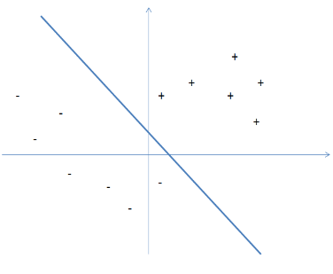

# Generalization

Prev: [[04-curse-of-dimensionality]]
Next: [[06-regularization]]

## Data Sets as Random Samples

There are two general modes when analyzing data sets:

1. To deeply understand the peculiarities of a single dataset and say something meaningful about just that dataset.
2. Using a dataset to extrapolate to additional data.

For example, when rolling out the Covid-19 Vaccine, you might use some randomized controlled trial to say something about the population at hand.

For example, for the COVID-19 Vaccine, of the 21,720 people who received the vaccine, 8 people got covid more than 7 days after the second dose. In comparison, of the 21,728 participants who received a placebo, 162 people got covid. We would like to take this data and generalize it throughout the population.

We'll start off with the assumption that data points are random samples from some underlying population. There's a lot of things to be careful of when assuming this in the real world, but we'll assume all our samples follow this rule.

Another example might be classifying spam, from an intiial labeled dataset. We learn an algorithm on the dataset, and then let it out in the wild, to have it label more things as spam.

## Binary Classification

There are many types of learning problems, but we'll focus on **Binary Classification problems**, which involve the following.

1. Data points correspond to points in $d$-dimensional Euclidean space $\Bbb R^d$. For the spam problem, this would be $d$ different words that we're keeping track of.
2. There is a "ground truth" function $f : \Bbb R^d \to \{0, 1\}$ specifying the correct classification of each datapoint (i.e. there is a mapping of every datapoint to true or false, and this never changes). The function f is unknown and is what we want to learn.
3. There is an unknown distribution $D$ on $\Bbb R^d$. We can simplify $D$ as the uniform distribution over a very large finite subset of $R^d$ (like all emails with at most 10,000 unique characters).

Here's the problem solved by a learning algorithm:

**Input**: $n$ data points $x_1,\dots,x_n \in \Bbb R^d$, with each $x_i$ drawn i.i.d from the distribution $D$, with a corresponding $f(x_1),\dots,f(x_n) \in \{0, 1\}$. The $x_i$ constitute the training data, where $f(x_i)$ is labeled as either true or false.

**Output**: The responsibility of the learning algorithm is to create a prediction function $g: \Bbb R^d \to \{0, 1\}$.

**Success criterion**: the prediction function $g$ should be as close as possible to $f$. It would look something like this, where we want our function $g$ to match the line drawn here, $f$.

There are two more critical aspects of the learning problem:

1. The amount of data. The more data you have, the closer you are to learning about the ground truth function $f$.
2. The number of possible functions that might be the truth. The fewer functions that you're trying to distinguish between, the easier the learning problem.

## Training Error and Generalization

The goodness of a prediction function $g$ can be assessed with the generalization error, the probability that g disagrees with the ground truth $f$ on the label of a random sample.

$$generalization error(g) = Pr_{x \sim D}[g(x) \neq f(x)]$$

We can't calculate the generalization error of a prediction function, because we don't know $f$ nor the distribution $D$. We do know $n$ points, and their ground truth labels, so we can grade $g$ based on that. This is called the training error of $g$:

$$training error(g) = \frac{1}{n} * [number of x_i's with g(x_i) \neq f(x_i)]$$

For any prediction function, its expected training error over the random sample is its generalization error. However, we don't know if the training error of $g$ ona  random sample is likely to be close to its generalization error -- we don't have enough data.

This can be phrased as "does g generalize?" and it depends on the algorithm and the size of the data.

For example, if a learning algorithm outputs a prediction function $g$ with generalization error much higher than its training error, it has overfit the training data. When a prediction function overfits its training data, it doesn't say anything meaningful about the data.

## Analysis: The Well-Separated Finite Case

Let's start off with a simpler version of the learning problem with two assumptions:

1. (Finite) The ground truth function $f$ belongs to a known set $\{f_1,\dots,f_h\}$ of $h$ different functions. That is, there are only $h$ different possibilites for what $f$ might be, and we know the options up front.

2. (Well-separated) No function (other than $f$) is extremely close to $f$, meaning that every candidate $f_j \neq f$ has generalization error of at least $e$.

### Our First Learning Algorithm

Our first learning algorithm to get 0% generalization error is to output the following function:

$$g \in \{f_1,\dots,f_h\}$$

Thus, it has 0% training error. We don't know if it generalizes, because we don't know how large our $n$ should be.

### Getting Tricked by a Single Function

We want to avoid getting tricked, that is, generating a function $f_j$ that is different from the true $f$. We're concerned about getting tricked by $f_j$, meaning that it winds up having 0% training error, despite it having a generalization error $\gt e$.

The probability of that is:

$$Pr_{x_1,\dots,x_n} \sim D[f_j(x_i) = f(x_i) \text{ for all i} = 1,2,\dots,n] = \displaystyle \pi{i=1}^n Pr_{x_i} \sim D [f_j(x_i) = f(x_i)]$$

Which is $\le e^-en$.

So the probability is decreasing exponentially with the number of samples $n$.

### The Union Bound

The union bound says that for events $A_1,\dots,A_h$,

$$Pr[\text{at least one of the } A_i\text{'s occurs} \le \displaystyle \sum{i=1}^h Pr [A_i]$$

Basically, this says that at least one of the events occurring is bound by the minimum of the less likely event.

In most applications, the events $A_1,\dots,A_h$ are bad events that we don't want to happen. The union bound says that as long as each event occurs with low probability and there aren't too many events, then with high probability, none of them occur.

### Completing the Analysis

Let $A_j$ denote that an incorrect function $f_j \ne f$ has 0% training error on $n$ samples, despite having generalization error at least $e$. Since there are $h$ such values of $j$, the union bound implies that this probability is:

$$
\Pr_{x_1,\dots,x_n \sim D}\bigl[\text{some } f_j \ne f \text{ has } 0\% \text{ training error}\bigr]
\le \sum_{j = 1}^h e^{-\varepsilon n}
= h e^{-\varepsilon n}
$$

We can simplify this to
\[
\Pr[\text{learning algorithm succeeds}] \ge 1 - h e^{-\varepsilon n},
\]
so \(h e^{-\varepsilon n}\) is an upper bound on the failure probability of the learning algorithm.  
The upper bound increases linearly with the number of possible functions \(h\), but decreases exponentially with the size of the training set \(n\).

So, if we wanted some \(\sigma = 1\%\), we set
\[
h e^{-\varepsilon n} = \sigma
\]
and solve for \(n\):
$$
n \ge \frac{1}{\varepsilon}\left(\ln h + \ln \frac{1}{\sigma}\right).
$$

With probability \(1 - \sigma\), the output of the learning algorithm is the ground truth function \(f\).

So, generalization error is linear in \(1/\varepsilon\) (to reduce it from \(10\%\) to \(1\%\) requires \(10\times\) more data), but \(\frac{1}{\sigma}\) appears only inside a logarithm, so setting \(\sigma\) to be very small, even with large \(h\), is not a problem.

## PAC Guarantees: The Finite Case

Suppose we loosen the second argument, that there are no functions close to \(f\), the ground truth function. We now might output this other function \(f'\), but if it is similar enough to \(f\), it should be fine. We can use the same logic, with the stipulation that the output of the learning function has a generalization error less than \(\varepsilon\).

We obtain the same sample-complexity bound:
$$
n \ge \frac{1}{\varepsilon}\left(\ln h + \ln \frac{1}{\sigma}\right).
$$

This is a PAC guarantee, which is “probably approximately correct”.

## PAC Guarantees: Linear Classifiers

Now we loosen the first assumption, but with a caveat — that the ground truth function \(f\) has some structure. If \(f\) is unrestricted, from $\mathbb{R}^d$ to $({0, 1})$, then the unseen points could be anything, and the learning algorithm could not meaningfully say anything about them.

### Linear Classifiers

A linear classifier in $\mathbb{R}^d$ is specified by a $(d)$-vector $a = (a_1,\dots,a_d) \in \mathbb{R}^d$ of real coefficients, and is defined as the function $f_a : \mathbb{R}^d \to \{0, 1\}$:
$$
f_a((x_1,\dots,x_d)) =
\begin{cases}
1, & \text{if } \displaystyle\sum_{i=1}^d a_i x_i \ge 0, \\
0, & \text{if } \displaystyle\sum_{i=1}^d a_i x_i < 0.
\end{cases}
$$

A linear classifier in \(d\) dimensions has \(d\) degrees of freedom.

### From the Curse of Dimensionality to Generalization

The curse of dimensionality can be used for a positive result here. Since the number of distinct directions in $(\mathbb{R}^d)$ grows exponentially with $d$, and since the complexity of generalization grows logarithmically in the number of functions, there is a complexity of learning a good classifier which is linear in $d$, which is indeed what we obtain.

We use the same theorem:
$$
n \ge \frac{c}{\varepsilon}\left(d + \ln \frac{1}{\sigma}\right).
$$

Where c is a sufficiently large constant. The output of the learning algorithm is a linear classifier with generalization error less than $e$.

### A Rule of Thumb

If $n \gg d$, then prediction functions tend to generalize. If $n \ll d$, then they do not.

### FAQ

Three questions are:

1. How do we implement the learning algorithm?
2. What if no function has 0% training error?
3. What happens if $n \ll d$?

The next two sections answer the first and second question.

## Computational Considerations

The learning algorithm can be implemented in a few ways. If there are a finite number of candidates, then exhaustive search works. But for infinitely many linear classifiers, that won't work.

One way is to use linear programming, or to use iterative methods like stochastic gradient descent, perceptron, etc.

## Non-Zero Training Error and the ERM Algorithm

If the ground truth is not a linear function, we have to extend the learning algorithm somehow.

### Generalization Guarantees for the ERM Algorithm

Empirical Risk Minimization (ERM): Output the function $f$ (from the set of functions under consideration) that has the smallest training error, breaking ties arbitrarily.

This has a PAC guarantee like the basic learning algorithm, with larger sample complexity.

### Sample Complexity Considerations

Since the ERM algorithm has a worse complexity bound by a factor of $\frac{1}{e}, it is NP-hard, and we require heuristics.

Prev: [[04-curse-of-dimensionality]]
Next: [[06-regularization]]
