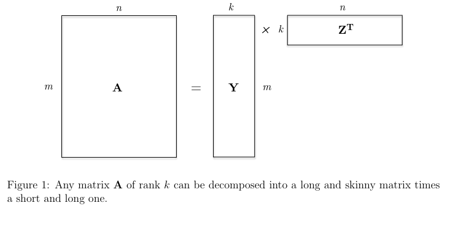
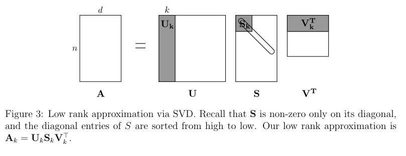

# Low-rank matrix approximations

Prev: [[08-how-pca-works]]
Next: [[10-tensor-methods]]

## What are the Missing Entries?

Consider this matrix:

$$
\begin{bmatrix}
7  & ?  & ? \\
?  & 8  & ? \\
?  & 12 & 6 \\
?  & ?  & 2 \\
21 & 6  & ?
\end{bmatrix}
$$

It would be unfair to ask what the missing numbers would be. They could be anything. But if it has nice structure, more specifically, all rows are multiples of each other, then you can fill in the blanks.

$$
\begin{bmatrix}
7  & 2  & 1 \\
28 & 8  & 4 \\
42 & 12 & 6 \\
14 & 4  & 2 \\
21 & 6  & 3
\end{bmatrix}
$$

Once you know something about the structure of a partially known matrix, it's possible to recover all of the lost information.

## Matrix Rank

**Rank-0 Matrices**: There is only one rank-zero matrix, the all-zero matrix.

**Rank-1 Matrices**: A non-zero matrix where all rows are multiples of each other.

**Rank-2 Matrices**: A rank-two matrix is a superposition of two rank-1 matrices.

As well, any matrix **A** of rank *k* can be decomposed into a long and skinny matrix times a short and long one.

**Rank-k Matrices**:

Thus, a matrix **A** has rank *k* if it can be written as the sum of *k* rank-one matrices, and cannot be written as the sum of *k* - 1 or fewer rank-one matrices.

## Low-Rank Matrix Approximations: Motivation

Some applications of approximating matrices, doing a **low-rank approximation** are:

1. **Compression**: The uncompressed matrix **A** is described by $m * n$ numbers, whereas the compressed version that describes **Y** and $\Bbb Z^T$ requires only $k(m + n)$ numbers. When $k$ is small relative to $m$ and $n$, replacing the product of $m$ and $n$ has large savings. For an image, where $m$ and $n$ are in the 10000s, a modest value of $k$, like 100 or 150 can achieve approximations thata re good enough.

2. **De-noising**: If **A** is a noisy version of a "ground truth" signal that is approximately low-rank, then using a low-rank approximation of **A** might be more informative than the original.

3. **Matrix completion**: Low-rank approximations are a good first step to fill in missing data. TO figure out what these default values should be requires trial and error, but may include filling with 0, the average of known entries in the same row or column, and the average of entries in the matrix, or to compute the best rank-k approximation to **A**. This works reasonably well when the unknown matrix is close to a rank-k matrix and there are not too many missing entries.

Matrix completions can be done with the **Singular Value Decomposition**, the SVD, which does the following:

1. express **A** as a list of ingredients, ordered by importance.
2. keep only the k most important ingredients.

## The Singular Value Decomposition (SVD)

The SVD defines an $m x n$ matrix **A** as the product of three simple matrices:

$$ A = USV^T $$

where:

1. **U** is an $m x n$ orthogonal matrix.
2. **V** is an $m x n$ orthogonal matrix;
3. **S** is an $m x n$ diagonal matrix with nonnegative entries, with the diagonal entries sorted from high to low.

**U** and **V** are not the same, due to **A** not needing to be square.

The columns of **U** are called the left singular vectors of **A**, and the columns of **V** are the right singular vectors of **A**. The entries of **S** are the singular values of **A**.

The factorization of $A = USV^T$ is equivalent to the expression:

$$ A = \displaystyle \sum_{i=1}^{min\{m, n\}} s_i * u_i v_i $$

where $s_i$ is the ith singular value and $u_i, v_i$ are the left and right singular vectors. Thus, SVD expresses **A** as a nonnegative linear combination of $min\{m, n\}$ rank-1 matrices.

Every matrix **A** has a SVD. If you think of an $m * n$ matrix as a mapping from $\Bbb R^n$ to $\Bbb R^m$, then every matrix, is only performing a rotation in the domain (a multiplication by $V^T$), then a scaling + adding or subtracting dimensions (multiplication by **S**), followed by a rotation in the range (multiplication by **U**).

The SVD of a matrix A takes $min\{O(m^2n), O(n^2m)\}$ time, and to compute the largest $k$ singular values, takes $O(kmn)$ time.

## Low-Rank Approximations from the SVD

Since the SVD reduces to the k rank-1 matrices that sum up to the original matrix, we can just keep the top K parts!

This would result in:

$$ A' = \displaystyle \sum_{i=1}^{k} s_i * u_i v_i $$

In more detail, this looks like this:

1. Compute the SVD $A = USV^T$ where **U** is an $m x n$ orthogonal matrix, **S** is a nonnegative $m x n$ diagonal matrix with diagonal entries sorted from high to low, and $V^T$ is an $n x n$ orthogonal matrix.

2. Keep the top $k$ right singular vectors: set $V_{k}^T$ equal to the first k rows of $V^T$.

3. Keep only the top $k$ left singular vectors: set $U_k$ equal to the first k rows of $U_k$.

4. Keep only the top k singular values: set $S_k$ equal to the first k rows and columns of **S**, corresponding to the $k$ largest singular values of **A**.

5. The rank-k approximation becomes:

$$ A_k = U_kS_kV_k^T $$

This only requires $O(k(m + n))$ space to store the matrix, in contrast to $O(mn)$ space normally required.

Basically, $k$ is the concepts, where $S_k$ express the signal strengths of the concepts, and the rows of $V^T$ and columns of $U$ express the canonical row/column with each concept.

This is optimal.

For every $m x n$ matrix **A** rank target $k \geq 1$ and rank-k $m x n$ matrix **B**:

$$ || A - A_k ||_F \leq ||A - B||_F $$

**Remark (How to choose k)**: In a perfect world it's pretty easy to choose $k$. The eye test works out. But you can choose some domain specific value that the top $k$ singular values is at least $c$ times as big as the sum of the other singular values, where $c$ is something like 10.

**Remark (Lossy Compression via Truncated Decompositions)**: If your data is similar to an approximated low-rank matrix with nice structure, you can pick some low-rank approximation, throw away the rest of the data, and use that instead.

## PCA Reduces to SVD

PCA reduces to SVD, without forming $X^TX$.

## More on PCA vs. SVD

PCA is close to SVD. PCA is a data analysis approach, the best way to approximate data points as linear combinations of a small set of vectors. But the SVD works on all matrices.

The SVD does have an advantage: it returns **U**, which gives information on the columns as well as the rows. PCA only gives information on the rows.

1. Imagine a matrix **X**, where the rows are customers and the columns are the products they buy. By interpreting both the rows and columns, you can predict both the products bought but also the customer types.

2. Imagine a matrix of drug interactions, where the rows are indexed by proteins or pathways, and the columns by drugs. It's useful to see both how proteins and drugs interact.

Prev: [[08-how-pca-works]]
Next: [[10-tensor-methods]]
