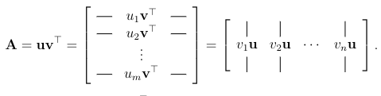
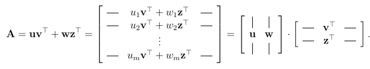
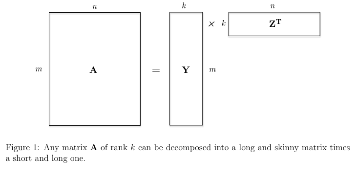
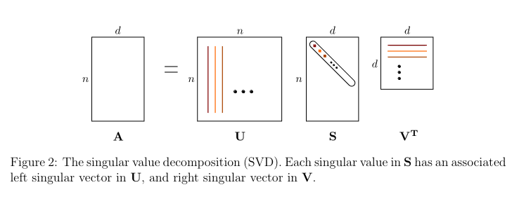

# Low-rank matrix approximations

Prev: [how-pca-works](how-pca-works.md)
Next: [tensor-methods](tensor-methods.md)

## What are the Missing Entries?

Consider this matrix:

$$
\begin{bmatrix}
7  & ?  & ? \\
?  & 8  & ? \\
?  & 12 & 6 \\
?  & ?  & 2 \\
21 & 6  & ?
\end{bmatrix}
$$

It would be unfair to ask what the missing numbers would be. They could be anything. But if it has nice structure, more specifically, all rows are multiples of each other, then you can fill in the blanks.

$$
\begin{bmatrix}
7  & 2  & 1 \\
28 & 8  & 4 \\
42 & 12 & 6 \\
14 & 4  & 2 \\
21 & 6  & 3
\end{bmatrix}
$$

Once you know something about the structure of a partially known matrix, it's possible to recover all of the lost information.

## Matrix Rank

**Rank-0 Matrices**: There is only one rank-zero matrix, the all-zero matrix.

**Rank-1 Matrices**: A non-zero matrix where all rows are multiples of each other.

**Rank-2 Matrices**: A rank-two matrix is a superposition of two rank-1 matrices.

As well, any matrix **A** of rank *k* can be decomposed into a long and skinny matrix times a short and long one.

**Rank-k Matrices**:

Thus, a matrix **A** has rank *k* if it can be written as the sum of *k* rank-one matrices, and cannot be written as the sum of *k* - 1 or fewer rank-one matrices.

## Low-Rank Matrix Approximations: Motivation

Some applications of approximating matrices, doing a **low-rank approximation** are:

1. **Compression**: The uncompressed matrix **A** is described by $m * n$ numbers, whereas the compressed version that describes **Y** and $\Bbb Z^T$ requires only $k(m + n)$ numbers. When $k$ is small relative to $m$ and $n$, replacing the product of $m$ and $n$ has large savings. For an image, where $m$ and $n$ are in the 10000s, a modest value of $k$, like 100 or 150 can achieve approximations thata re good enough.

2. **De-noising**: If **A** is a noisy version of a "ground truth" signal that is approximately low-rank, then using a low-rank approximation of **A** might be more informative than the original.

3. **Matrix completion**: Low-rank approximations are a good first step to fill in missing data. TO figure out what these default values should be requires trial and error, but may include filling with 0, the average of known entries in the same row or column, and the average of entries in the matrix, or to compute the best rank-k approximation to **A**. This works reasonably well when the unknown matrix is close to a rank-k matrix and there are not too many missing entries.

Matrix completions can be done with the **Singular Value Decomposition**, the SVD, which does the following:

1. express **A** as a list of ingredients, ordered by importance.
2. keep only the k most important ingredients.

## The Singular Value Decomposition (SVD)

The SVD defines an $m x n$ matrix **A** as the product of three simple matrices:

$$ A = USV^T $$

where:

1. U is an $m x n$ orthogonal matrix.
2. V is an $m x n$ orthogonal matrix;
3. S is an $m x n$ diagonal matrix with nonnegative entries, with the diagonal entries sorted from high to low.

Prev: [how-pca-works](how-pca-works.md)
Next: [tensor-methods](tensor-methods.md)
