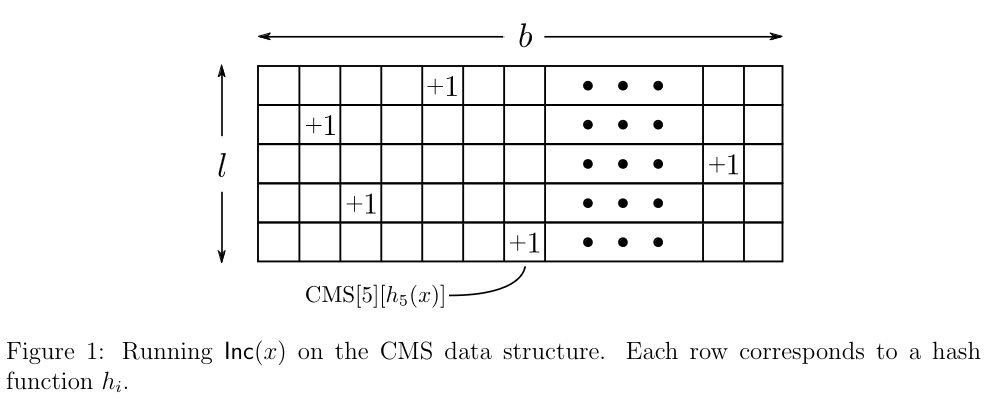

# Property-preserving lossy compression

Prev: [introduction-consistent-hashing](introduction-consistent-hashing.md)
Next: [similarity-search](similarity-search.md)

## Heavy Hitters

Imagine that given an array $A$ of length $n$, find an item $i$ that is a majority element, that is, $i$ appears $\gt \frac{n}{2}$ times.
One way to do this is to compute the median of $A$, which will always be the majority element.

However, we can do better with only one pass.

```
counter := 0, current := NULL
for i = 1 to n:
    if counter = 0:
        current := A[i]
        counter++
    else if A[i] = current:
        counter++
    else:
        counter--
return current
```

To prove that this always works, you could say that there must be $\lt \frac{n}{2}$ items that are non-majority, and $\gt \frac{n}{2}$ items that are majority. If we sum up the occurrences of the non-majority elements as -1, and the majority elements as 1, you would always get a positive sum (since there is always at least one more majority item).

## The Heavy Hitters Problem

In the heavy hitters problem, the input is an array $A$ of length $n$, and also a parameter $k$. Assume $n \gg k$. The goal is to compute the values that occur in the array at least $\frac{n}{k}$ times. There can be up to $k$ such values.

This has a lot of applications, including:

1. Computing popular products (e.g. on Amazon)
2. Computing frequent search queries (e.g. on Google)
3. Identifying heavy TCP flows (e.g. to determine denial of service attacks)
4. Identifying volatile stocks. (e.g. options volume)

Of course, to find out which items appear $\frac{n}{k}$, we could sort the array and output a result only if it appears consequentively at least $\frac{n}{k}$ times.

## An Impossibility Result

There is no algorithm that solves the Heavy Hitters problem in one pass while using a sublinear amount of auxiliary space.

This is provable because if $n \gg k$, then we can assume that $\frac{n}{k} \approx n$, so we would need $\approx n$ memory to hold the possible unique items (due to the pigeonhole principle). Thus, as long as $k$ is not on the order of $n$, heavy hitters reduces to the set membership problem, $y \in S$. Thus, we need at least $S$ memory, or in this case, $n$ memory to solve the generalized heavy hitters problem.

## The Approximate Heavy Hitters

Let's solve the approximate Heavy Hitters problem, where the input is an array $A$ of length $n$, and user-defined parameters $k$ and $e$, where:

1. Every value that occurs at least $\frac{n}{k}$ times in $A$ is in the list.
2. Every value in the list occurs at least $\frac{n}{k} - en$ times in A.

Suppose we set $e = \frac{1}{2k}$. Thus, the algorithm outputs every value with frequent count at least $\frac{n}{k}$, and only values with frequency count at least $\frac{n}{2k}$. This has a space usage of $k$, which is fine.

## The Count-Min Sketch

The Count-Min Sketch has been used widely, and is a hash-based algorithm that is similar to "lossy compression". It throws away most of its data while still being able to make accurate inferences about it.

## Count-Min Sketch: Implementation

The Count-Min sketch supports two operations: $Inc(x)$ and $Count(x)$. $Count(x)$ returns the frequency count of $x$, which is the number of times that $Inc(x)$ has been invoked in the past.

Count-Min sketch has two parameters: the number of buckets $b$, and the number of hash fucntions, $l$. Given that $b \ll n$, this compression leads to errors, and are also independent of the length of the array, $n$. That data structure starts out as an $l$ by $b$ 2-D array of counters, all initially 0.



After choosing the $l$ hash functions $h1,\dots,h_{l}$, each mapping the universe of objects to $\{1,2,\dots,b\}$, the code for $Inc(x)$ is:

$\text{for i in} \{1,2,\dots,l\}$:

Increment $CMS[i][h_{i}(x)]$

Assuming each hash function can be evaluated in constant time, the running time is $O(l)$, which is $O(1)$.

Choose a row $i \in \{1,2,\dots,l\}$. Since every time $Inc(x)$ is called, the same counter $CMS[i][h_{i}(x)]$ is incremented, and never decremented, clearly:

$$CMS[i][h_{i}(x)] \ge f_{x}$$

where $f_{x}$ is the frequency count of $x$. Thus, $CMS[i][h_{i}(x)]$ cannot underestimate $f_{x}$, it overestimates it.

Since our estimates only suffer one-sided error, the **smallest** estimate is the best. Thus, $Count(x)$ is:

$$\min_{i=1\to l}(CMS[i][h_{i}(x)])$$

Errors are bounded to $b$ and $l$.

## Count-Min Sketch: Heuristic Error Analysis

To get an error rate around 1%, setting $l$ to 5 is good enough.

## Solving the Approximate Heavy Hitters Problem

With the Count-Min Sketch, we can solve the approximate heavy hitters problem.

If we know the length, $n$, then process the array elements using CMS in a single pass, and remember an element once its estimated frequency is $\gt \frac{n}{k}$.

If we don't know the length, then we can store potential heavy hitters in a heap data structure. Keep a count of seen items, $m$. When processing the next object $x$ of the array, invoke $Inc(x)$ and then $Count(x)$. If $Count(x) \ge \frac{m}{k}$, then store $x$ in the heap, using the key $Count(x)$. We also check to see if $\frac{m}{k}$ is greater than the minimum key in the heap. If so, we pop it, continuing onto subsequent elements if necessary.

Prev: [introduction-consistent-hashing](introduction-consistent-hashing.md)
Next: [similarity-search](similarity-search.md)
