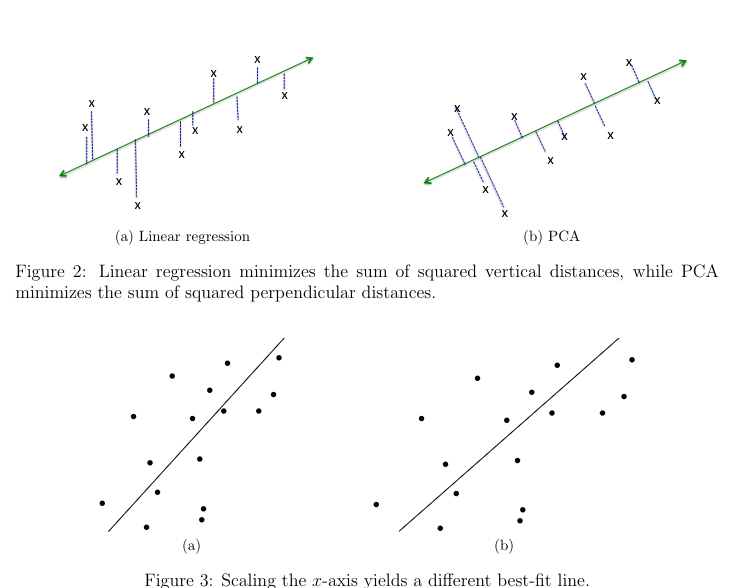
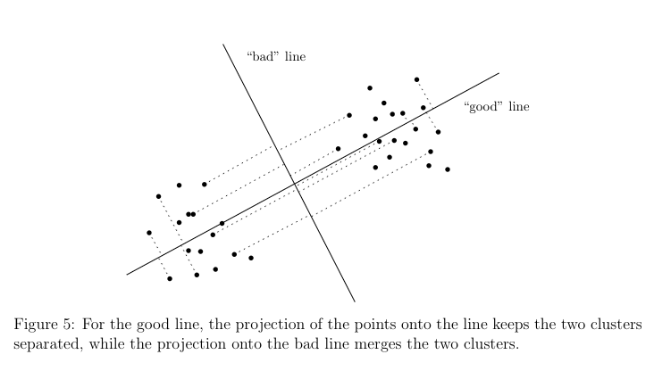
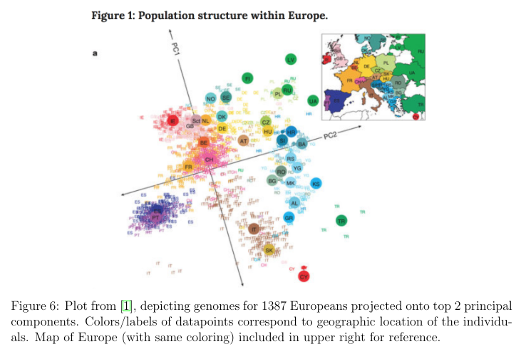

# Understanding Principal Component Analysis

Prev: [regularization](regularization.md)
Next: [how-pca-works](how-pca-works.md)

## A Toy Example

PCA is used to visualize the data in a lower-dimensional space, to understand sources of variability in the data, and to understand correlations between different coordinates of data points.

Take this table, where your friends rate on a scale of 1 to 10, four foods, kale, taco bell, sashimi, and pop tarts.

|         | kale | taco bell | sashimi | pop tarts |
|---------|------|-----------|---------|-----------|
| Alice   | 10   | 1         | 2       | 7         |
| Bob     | 7    | 2         | 1       | 10        |
| Carolyn | 2    | 9         | 7       | 3         |
| Dave    | 3    | 6         | 10      | 2         |

There are 4 data points ($m$), and 4 dimensions ($n$).

We can represent the data points thusly:

The average of all data points is the vector:

$$ \bar{x} = (5.5, 4.5, 5, 5.5) $$

Where the vectors $v_1$ and $v_2$ are the following:

$$ v_1 = (3, -3, -3, 3) $$

$$ v_2 = (1, -1, 1, -3) $$

And each data point can be expressed this way:

$$ \bar{x} + a_1 v_1 + a_2 + v_2 $$

And $(a_1, a_2)$ is $(1,1)$ for Alice, $(1, -1)$ for Bob, etc.

So to calculate Alice's scores, you would calculate $\bar{x} + v_1 + v_2$, and for Bob's scores, $\bar{x} + v_1 - v_2$.

This is useful to plot the data, and also to interpret the data.

If we look at $v_1$, we notice that items 1 and 4 are highly correlated, and items 2 and 3 are as well. Thus, we can guess that pairs (1, 4) and (2, 3) are alike, and also (1, 4) and (2, 3) are very unalike.

Since we know that kale salad and pop tarts are vegetarian, and taco bell and sashimi are not, one guess could be that $v_1$ encodes the vegetarian preferences of the person.

As well, $v_2$ could encode the health consciousness of the person, since kale salad and sashimi are more health conscious than pop tarts and taco bell.

Once normalized, the vectors $v_1$ and $v_2$ correspond to the top two principal components of the data. PCA is used to compute approximations of this type automatically, for large data sets.

### Goal of PCA

The goal of PCA is to approximately express each $m$ of $n$-dimensional vectors $x_1,\dots,x_m \in \Bbb R^n$ as linear combinations of $k$ $n$-dimensional vectors $v_1,\dots,v_k \in \Bbb R^n$, so:

$$x_i \approx \displaystyle \sum_{j=1}^k a_{ij}v_j$$

For each $i = 1,2\dots,m$. PCA offers a definition of which $k$ vectors are the best ones for this purpose.

### Relation to Dimensionality Reduction

This is similar to the JL dimensionality reduction technique.

There are a few differences:

1. JL dimensionality reduction assumes that you care about the Euclidean distance between each pair of points. PCA offers no guarantees about preserving pairwise distances.
2. JL dimensionality reduction is data-oblivious, where the randomly chosen vectors $r_1,\dots,r_k$ are chosen without looking at the data points. PCA is deterministic, where the point is to compute vectors $v_1,\dots,v_k$ that explain the dataset.
3. The $k$ coordinates used in JL have no intinsic meaning, whereas in PCA they do.
4. JL only gives good results when $k$ is at least in the low hundreds. PCA can give meaningful results even when $k$ is 1 or 2, but there are also datasets where it provides little interesting information, for any $k$.

### Relation to Linear Regression

Linear Regression and PCA create the best fitting $k$ dimensional subspace to a point set. This works when each data point has a label, and there is a relationship between one coordinate to the rest of the coordinates. They are also assumed to be independent of each other.

In PCA, all coordinates are treated equally, and they are not independent from each other.

As well, Linear Regression and PCA have different definitions of best fit.

Linear Regression minimizes the total squared error, as that creates a line of best fit that minimizes the sum of squared vertical distances between the line and data points. This is because in linear regression, the coordinate corresponding to labels is the important one.

In PCA, the squared perpendicular distances are minimized, which shows that all coordinates play a symmetric role, and Euclidean distance is most appropriate.

## Defining the Problem

### Preprocessing

First, preprocess the data by centering points around the origin, so that $x_1,\dots,x_m$ has an all-zero vector, $\displaystyle \sum_{i=1}^m x_i$. This can be done by subtracting each point by the sample mean, $\bar{x} = 1 / m \displaystyle \sum{i=1}^m x_i$.

Afterwards, the data is unshifted. This makes the linear algebra easier to apply.

It is also important to scale each coordinate, so the units each coordinate is measured in does not affect the best-fit line.

One approach involves taking the points $x_1,\dots,x_m$ centered at the origin, then for every coordinate $j = 1,2,\dots,n$, divide the $j$th coordinate by the sample deviation, $\sqrt{\displaystyle \sum_{i=1}^m x_{ij}^2}$.

If this isn't done, then the line of best fit changes for a unit, say between kilometers and miles, even though the underlying data is the same, just measured with different units.

### The Objective Function

The best fit line for a dataset with a $k$ of 1 looks like this:

$$ argmin 1 / m \displaystyle \sum_{i=1}^m ((\text{distance between } x_i \text { and line spanned by } v))$$

Minimizing the Euclidean distance between points and the chosen line is done above, but also, the distances are squared before adding up. This ensures the best-fit line passes through the origin, and maximizes variance.

Maximizing variance is useful for PCA, since it preserves clusters that are disimilar from each other in higher dimensional space. It should be used for when variance is thought to glean useful information. If variance is just noise, then it won't be useful.

### Larger Values of $k$

For more dimensions than one, the work is similar. The PCA objective funciton becomes:

$$ \text{argmax on k-dimensional subspaces} \frac{1}{m} \displaystyle \sum_{i=1}^m(\text{length of }x_i\text{'s projection on S})^2$$

Recalling that vectors $v_1,\dots,v_k$ are orthonormal if they have unit length $(||v_i||_2 = 1$ for all i, and are orthogonal $(v_i, v_j) = 0$ for all $i \neq j$. Rotating these vectors gives more sets of orthonormal vectors.

The span of a collection $v_1,\dots,v_k \in \Bbb R^n$ of vectors is their linear combinations: $\{ \displaystyle \sum_{j=1}^k \lambda_jv_j : \lambda_1,\dots,\lambda_k \in \Bbb R\}$. If $k = 1$ then this span is a line through the origin. For $k = 2$ where $v_1$ and $v_2$ are linearly independent, then the span is a plane through the original.

Orthonormal vectors $v_1,\dots,v_k$ is that the squared projection length of a point onto the subspace spanned by the vectors is just the sum of squares of its projections onto each of the vectors:

$$ (\text{length of }x_i's \text{ projection on span}(v_1,\dots,v_k))^2 = \displaystyle \sum_{j=1}^k (x_i,v_j)^2$$.

Combining the last two equations, we can state the objective of PCA for general $k$ in its standard form. Compute orthonormal vectors $v_1,\dots,v_k$ to maximize:

$$ \frac{1}{m} \displaystyle \sum_{i=1}^k \sum_{j=1}^k (x_i,v_j)^2$$

The right hand side is the squared projection length.

The resulting $k$ orthonormal vectors are the top $k$ principal components of the data.

More formally:

$$ \text{Given }x^1,\dots,x^m \in \Bbb R^n \text{ and a parameter } k \ge 1 \text{, compute orthonormal vectors } v_1,\dots,v_k \in \Bbb R^n \text{ to maximize the previous equation} $$

## Use Cases

### Data Visualization

PCA is commonly used for data visualization. One typically takes $k$ to be 1,2,3. Given data points $x_1,\dots,x_m \in \Bbb R^n$:

1. Perform PCA to get the top $k$ principal components $v_1,\dots,v_k \in \Bbb R^n$.

2. For each data point $x_i$, define its $v_1$-coordinate as $(x_i
,v_1)$, its $v_2$-coordinate as $(x_i,v_2)$, etc. This sets $k$ coordinates with each data point $x_i$.

3. Plot the point $x_i$ in $\Bbb R^k$ as the point $((x_i, v_i),\dots,(x_i,v_k))$.

One way to think about PCA is a method for approximating data points as linear combinations of the same $k$ vectors. PCA uses the vectors $v_1,\dots,v_k$, and the coordinates $((x_i,v_1),\dots,(x_i,v_k))$ to specify the lienar combination of these vectors that most closely approximate $x_i$. Thus, PCA approximates each $x_i$ as:

$$ x_i \approx \displaystyle \sum_{j=1}^k (x_i,v_j)v_j $$

### Interpreting the Results

Both the $v_j$ and the projections of $x_i$ onto them are interesting.

1. The datapoints with the largest and smallest projections $(x_i,v_1) on the first principal component may suggest a potential meaning for the component. If any data points are clustered together at each of the two ends, they may have something in common that is illuminating.

2. Plot all points according to their $k$ coordinate values. See if any clusters pop up at the corners. For example, looking at pairs that have similar second coordinates, it's possible to get a rough interpretation of the second principal component.

3. The coordinates of a principal component can also be helpful.

### Do Genomes Encode Geography?

PCA can be used to depict genomes in Europe on two dimensions. 1387 Europeans were analyzed on 200,000 SNPs, which are genomes. So with an $m \approx 1400$, $n \approx 200,000$ and $k = 2$, with two principal components, $v_1$ and $v_2$, this result appeared. $v_1$ was the latitude, and $v_2$ was the longitude, rotated 16 degrees.

Interestingly, this only held for Europe, because America was more sensitive to immigration trends.

### Data Compression

Another famous application of PCA is the Eigenfaces project. The data points are a bunch of faces, all framed the same way, under the same lighting conditions. Thus, $n$ is the number of pixels, 65k. However, the top 100-150 principcal components represents the components with high accuracy.

## Failure Cases

1. Scaling/normalization was messed up. PCA is sensitive to different scalings/normalizations, and getting good results from PCA involves choosing an appropriate scaling for the different data coordinates.

2. Non-linear structure. PCA finds a linear structure in the data, so if the data has some low-dimensional, non-linear structure, PCA will not find anything useful.

3. Non-orthogonal structure.

Prev: [regularization](regularization.md)
Next: [how-pca-works](how-pca-works.md)
