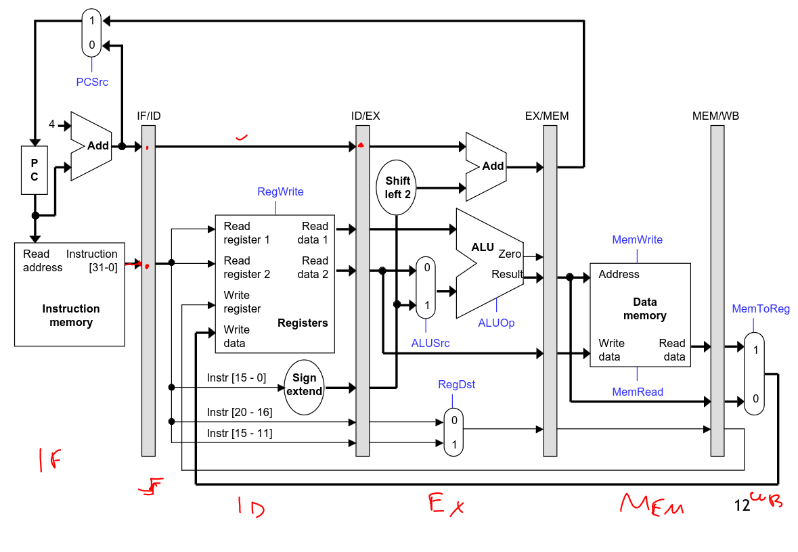

# Clock Speeds

Each processor has a clock speed, like 3GHz. Each clock speed is the
speed at which instructions are run.

Each instruction would normally go through a cycle like this:

As instructions have hit their limits, hardware designers have gotten
around this by making wider pipelines.

This would look something like this:

