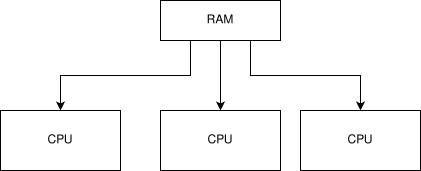

# What is NUMA?

NUMA stands for Non-uniform memory access, which provides separate memory for each processor in a computer,
avoiding synchronization penalties when cores need to access the same memory.
However, this can have performance penalties if different processors want to access the same information,
as the hardware will need to synchronize data in the cache between two processors,
but as long as that doesn't occur, there can be a linear speed up.

The reason why NUMA even exists is the following:

imagine a uniform memory architecture, which would look like this:

All is well and good when there are few CPUs -- they don't all have to
access the RAM at the same time and there's little contention. However,
when the number of CPUs increases, there's increased contention for RAM.
This can be taken care of a bit with caches (L1 per CPU, L2 which is
shared between CPUs on the same NUMA node, and L3, which is global
cache), but we hit a limit (due to the birthday problem: as the number
of cores `n` increases, the amount of contention increases polynomially
(around `n^2`). So if we have a lot of cores, there needs to be another
solution.

That solution would be NUMA, which looks like this:

There are two uniform memory architectures, connected by a bus, which
allows communication to occur over the two channels. This means that
accessing some RAM is slower for some cores than other cores, but means
that software can access all RAM at the same time, which keeps up the
illusion of the system operating as one.
