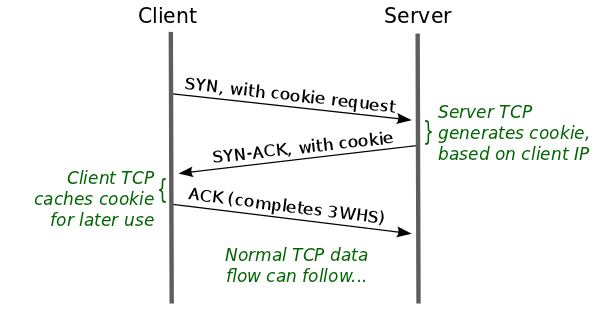
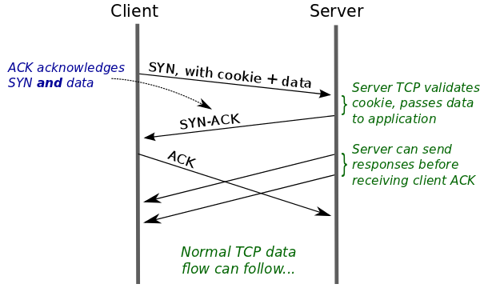

# What is TCP Fast Open?

The TCP Handshake currently consists of a `connect()` from the client, an `accept()` from the server, with an ack from the server and the client, costing three trips.

TCP fast open eliminates a round trip by using TFO (TCP Fast open cookies) to make sure that the client is not malicious.

To eliminate a round trip, servers can generate a cookie and ack in response, allowing clients to save a TFO cookie for later requests:

And on subsequent requests, the client can provide this cookie, saving a round trip:

