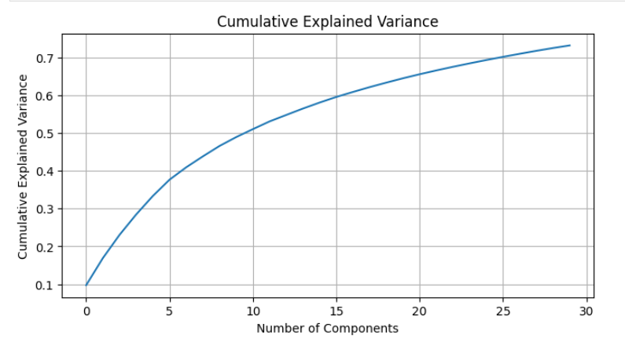
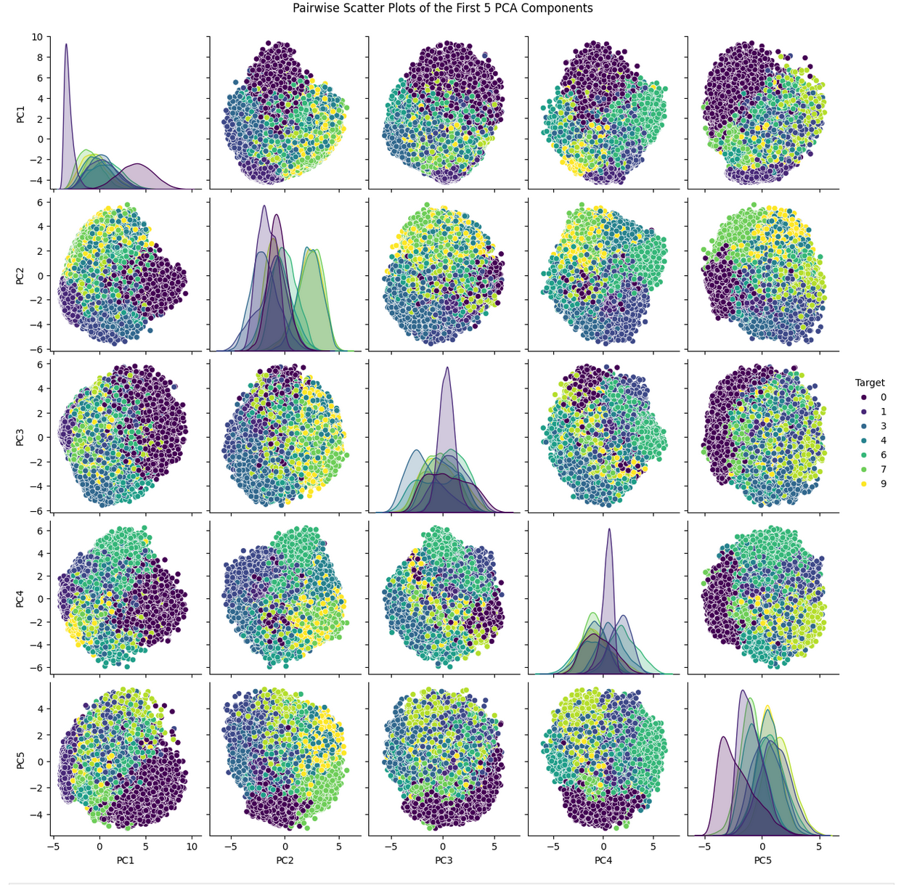

# Principal Components Analysis

PCA is an effective dimension reduction technique. If you have a dataset
with large dimensionality, you can reduce it to a dataset with fewer
dimensions that explains most of the variance.

PCA can be used on a large dataset to lower dimensionality to something
manageable.

```python
import numpy as np
import matplotlib.pyplot as plt
from sklearn.decomposition import PCA
from sklearn.datasets import fetch_openml
import seaborn as sns
```

```python
mnist = fetch_openml('mnist_784')
X = mnist.data / 255.0  # Normalize the data to [0, 1]
y = mnist.target.astype(np.int64)
```

```python
pca = PCA(n_components=30)
X_pca = pca.fit_transform(X)
```

```python
plt.figure(figsize=(8, 4))
plt.plot(np.cumsum(pca.explained_variance_ratio_))
plt.title('Cumulative Explained Variance')
plt.xlabel('Number of Components')
plt.ylabel('Cumulative Explained Variance')
plt.grid(True)
plt.show()
```



```python
# Convert the PCA results to a DataFrame for easier plotting
import pandas as pd
import seaborn as sns
pca_df = pd.DataFrame(X_pca[:, :5], columns=[f'PC{i+1}' for i in range(5)])
pca_df['Target'] = y  # Adding the target variable for coloring

# Use seaborn's pairplot to create the scatter plot matrix
sns.pairplot(pca_df, hue='Target', vars=[f'PC{i+1}' for i in range(5)], palette='viridis')
plt.suptitle('Pairwise Scatter Plots of the First 5 PCA Components', y=1.02)
plt.show()
```


