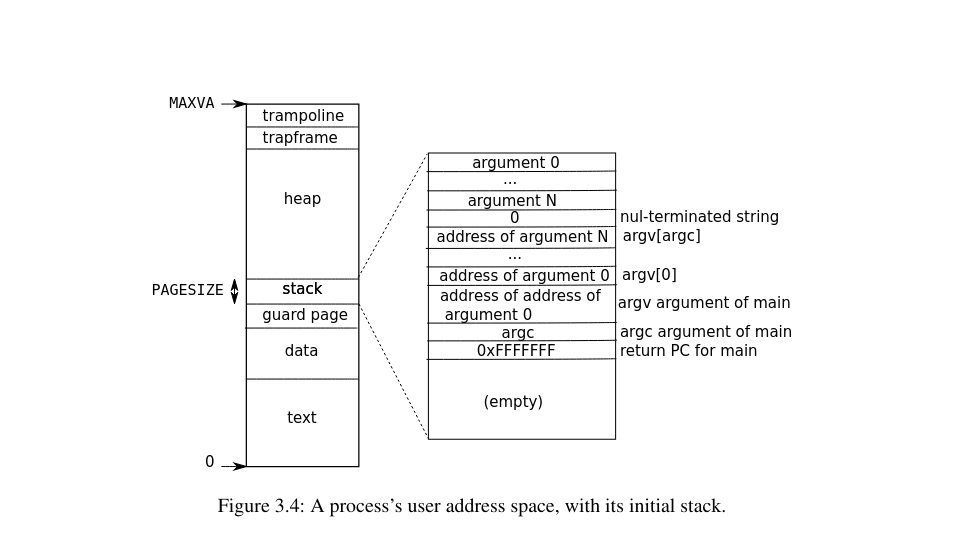

# Memory Layout

Most of the code is in `memlayout.h`.

## Trapping

After a trap, the kernel calls `uservec`, `usertrap`, `usertrapret`,
`userret`

- `uservec` saves user mode registers for later, and loads kernel
registers. It then switches to the kernel's address space by modifying
`satp`.
- `usertrap` handles the trap itself
- `usertrapret` then restores `satp`, to swap back to the user's address
  space, and the `sret` instruction restores the user mode program
  counter and enables interrupts.

## Trampoline and Trap Frames



Each user process contains the following:

- program code
- data
- the stack
- heap

With two special pages:

1. The trampoline page
    - shared amongst all user processes
    - contains `uservec` and `userret` functions
    - mapped as read-only and accessible for the supervisor

2. Trap frame page
    - unique per process
    - stores user registers during a trap
    - mapped as read-write but inaccessible in user mode.

The kernel also includes the trampoline page at its top.

## Kernel Virtual Address Space & Physical Memory


The kernel's memory layout starts at 0.

- Devices are mapped to specific addresses before 2GB.
- Physical RAM at 2GB, with up to 128MB.
- Kernel code and  data are stored in lower physical memory.

Kernel Virtual Address Space:

- The kernel's virtual address space is directly mapped to physical
memory.
- Devices are also directly mapped

Each of the 64 user processes have a dedicated kernel stack page.
With some guard pages, which are unmapped to prevent stack overflows.

## Memlayout.h

Memlayout.h contains memory layout constants:

- Devices are mapped at a constant location
- Hardware registers are mapped at specific addresses

- `KERNBASE` is the kernel load address (2GB)
- `PHYSTOP` is 2GB + 128MB, the end of physical memory
- `TRAMPOLINE` is the address of the trampoline page
- `TRAPFRAME` is the address of the trap frame page

```c
// 00001000 -- boot ROM, provided by qemu
// 02000000 -- CLINT
// 0C000000 -- PLIC
// 10000000 -- uart0
// 10001000 -- virtio disk
// 80000000 -- boot ROM jumps here in machine mode
//             -kernel loads the kernel here
// unused RAM after 80000000.

// the kernel uses physical memory thus:
// 80000000 -- entry.S, then kernel text and data
// end -- start of kernel page allocation area
// PHYSTOP -- end RAM used by the kernel

// qemu puts UART registers here in physical memory.
#define UART0 0x10000000L
#define UART0_IRQ 10

// virtio mmio interface
#define VIRTIO0 0x10001000
#define VIRTIO0_IRQ 1

// qemu puts platform-level interrupt controller (PLIC) here.
#define PLIC 0x0c000000L
#define PLIC_PRIORITY (PLIC + 0x0)
#define PLIC_PENDING (PLIC + 0x1000)
#define PLIC_SENABLE(hart) (PLIC + 0x2080 + (hart)*0x100)
#define PLIC_SPRIORITY(hart) (PLIC + 0x201000 + (hart)*0x2000)
#define PLIC_SCLAIM(hart) (PLIC + 0x201004 + (hart)*0x2000)

// the kernel expects there to be RAM
// for use by the kernel and user pages
// from physical address 0x80000000 to PHYSTOP.
#define KERNBASE 0x80000000L
#define PHYSTOP (KERNBASE + 128*1024*1024)

// map the trampoline page to the highest address,
// in both user and kernel space.
#define TRAMPOLINE (MAXVA - PGSIZE)

// map kernel stacks beneath the trampoline,
// each surrounded by invalid guard pages.
#define KSTACK(p) (TRAMPOLINE - ((p)+1)* 2*PGSIZE)

// User memory layout.
// Address zero first:
//   text
//   original data and bss
//   fixed-size stack
//   expandable heap
//   ...
//   TRAPFRAME (p->trapframe, used by the trampoline)
//   TRAMPOLINE (the same page as in the kernel)
#define TRAPFRAME (TRAMPOLINE - PGSIZE)
```
