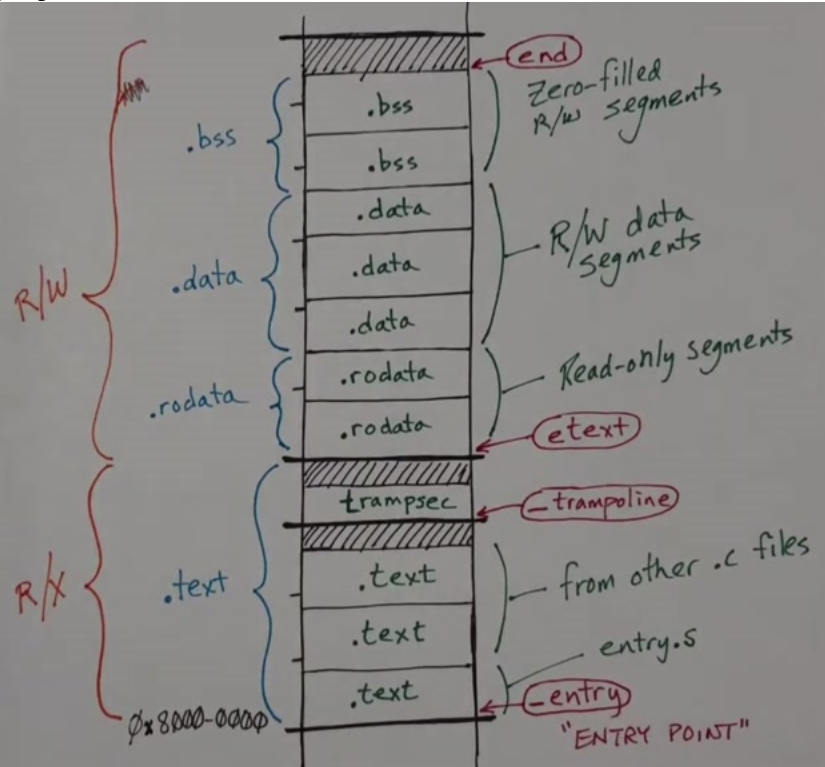

# Linker Layout

The kernel itself needs its memory laid out in a certain way. This is
done by using a linker script, which is in `kernel.ld`, that is a set of
directives to the compiler on how to layout the kernel program.

## Memory Segments



The kernel is laid out like so, which corresponds to the linker file itself:

```ld
OUTPUT_ARCH( "riscv" )
ENTRY( _entry )

SECTIONS
{
  /*
   * ensure that entry.S / _entry is at 0x80000000,
   * where qemu's -kernel jumps.
   */
  . = 0x80000000;

  .text : {
    *(.text .text.*)
    . = ALIGN(0x1000);
    _trampoline = .;
    *(trampsec)
    . = ALIGN(0x1000);
    ASSERT(. - _trampoline == 0x1000, "error: trampoline larger than one page");
    PROVIDE(etext = .);
  }

  .rodata : {
    . = ALIGN(16);
    *(.srodata .srodata.*) /* do not need to distinguish this from .rodata */
    . = ALIGN(16);
    *(.rodata .rodata.*)
  }

  .data : {
    . = ALIGN(16);
    *(.sdata .sdata.*) /* do not need to distinguish this from .data */
    . = ALIGN(16);
    *(.data .data.*)
  }

  .bss : {
    . = ALIGN(16);
    *(.sbss .sbss.*) /* do not need to distinguish this from .bss */
    . = ALIGN(16);
    *(.bss .bss.*)
  }

  PROVIDE(end = .);
}
```

- it starts the kernel at `0x80000000` so that `_entry` can jump there.
- then it sets up `.text` which contains trampoline code for the kernel
- `.rodata` which is aligned to 16-bytes, which stores constants
- `.data` which stores initialized variables
- `.bss` which has variables that start as zero
- provides an `end`, which is used by `kalloc` to denote where heap
  allocation starts
- provides `etext` which is the end of kernel code

```c
extern char end[]; // first address after kernel. Defined by kernel.ld.
```

## Linking Process

- `entry.o` is placed first in memory.
- other C files are linked in order after
- with the trampoline in `.text`

The compiler doesn't know the addresses to place everything beforehand
-- the linker takes care of that.

## Booting

- After linking, QEMU loads the kernel into memory.
- The kernel then runs, marking `.text` as executable, and `.data` as
  read-write, and restricts access to trampoline and trap frame pages.
