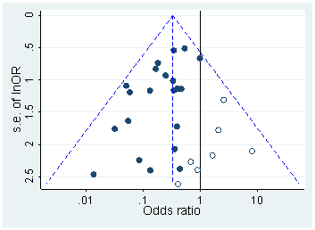
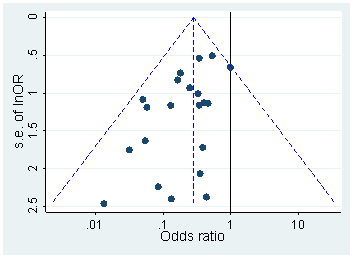

The author, Ioannidis is a medical academic, known widely for this paper where he purports that "most" i.e. 50%+ of published research findings are false, using some back of the envelope calculations.

Given how infamous this paper was when it came out in 2005, it led to a lot of responses by the academic community.

The paper starts out by saying that the academic community uses a p-value to see if there is an effect. Things that truly have an effect will return significant with a rate depending on the power of the study. However, things that do not have an effect will return significant with the type 1 error rate, which is roughly 5% of the time.

The author does give 6 corollaries to deduce whether a research finding is indeed true:

1. The smaller the studies conducted in a scientific field, the less likely the research findings are to be true.
2. The smaller the effect sizes in a scientific field, the less likely the research findings are to be true.
3. The greater the number and the lesser the selection of tested relationships in a scientific field, the less likely the research findings are to be true.
4. The greater the flexibility in designs, definitions, outcomes, and analytical modes in a scientific field, the less likely the research findings are to be true.
5. The greater the financial and other interests and prejudices in a scientific field, the less likely the research findings are to be true.
6. The hotter a scientific field (with more scientific teams involved), the less likely the research findings are to be true.

If we were to stop there, we could say that ~5% of all published research has a false-positive result, with ~95% of published research being true. However, the False Discovery Rate (FDR) increases with the proportion of the things in your test that have no effect, and also increases when the power of the study is low.

If the power of a study is low, type 1 error is not affected, but it lowers the rate of true positives compared to all positives (including false positives), thus making false positives more likely to appear significant compared to if the study had higher power, in which case the actually positive effect would be more likely to occur.

As well, if a researcher attempts many studies with low statistical power, they might stop when they get a significant result. Since their statistical power is low, they are more likely to miss the true treatment effect, since low power indicates that the false positive incidence rate is higher. Thus, unless there are large sample sizes (and the researcher had fewer degrees of researcher freedom to alter/retest a different hypothesis on the same data) it is very likely that they could try multiple times and find a false finding.

One interesting study that was done was by Kaplan and Irvin, 2017 [^1]. In it they explain that the likelihood of null effects of large clinical trials increased over time, from 43% to 92% after preregistration became required. The study analyzed very large studies with costs > $500,000/year, for drugs/dietary supplements aimed at the treatment or prevention of cardiovascular disease.

[^1]: https://journals.plos.org/plosone/article?id=10.1371/journal.pone.0132382

Prior to 2000, before pregistration of hypothesis was required, 17 of 30 studies had a significant benefit of intervention. However, after 2000, only 2 of 25 studies had a significant benefit of intervention. Thus, the null effect was 43% without preregistration, or 92% with preregistration.

Otherwise, one could try to find if there was a bias by using a funnel plot on the published research. Normally, the studies would be scattered in the plot somewhat normally [^2]. However, if there is some p-hacking or publication bias, then there might be an empty section in the graph [^3].

[^2]: 
[^3]: 
