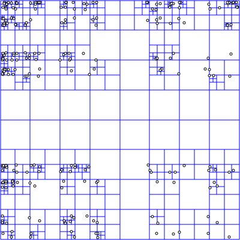
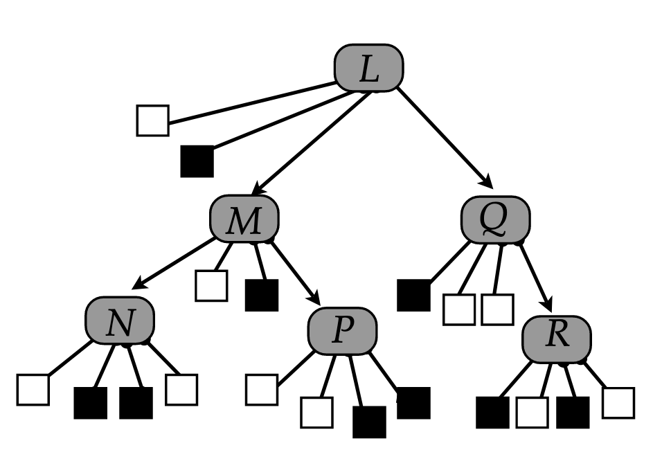

# Specialized Storage Paradigms

1.  BLOB store ex:(GG, S3)

- stands for: Binary large object,
- arbitrary pieces of unstructured data
- video, images, other files.
- access by file id.

2.  Time series Database (Influx DB, Prometheus)

- optimized for storing and analyzing time-indexed data,
- Popular for logging.
- Graph DBS (Neo 4J)
- data is stored in graphs which are related to each other by edges,
- uses the Cypher querying language. × spatial DB (Pos-1615)

3.  Spatial DBs

- used to store spatial data (coordinates)

- spatial DBs tend to use Quad Trees for indices Quad tree (either 0
  or 4 nodes)

   

- the grid is split into four recursively this keeps going until you
  enter a leaf node with 0 children.

Prev: \[key-value-stores](key-value-stores.md)
Next:
\[replication-and-sharding](replication-and-sharding.md)
